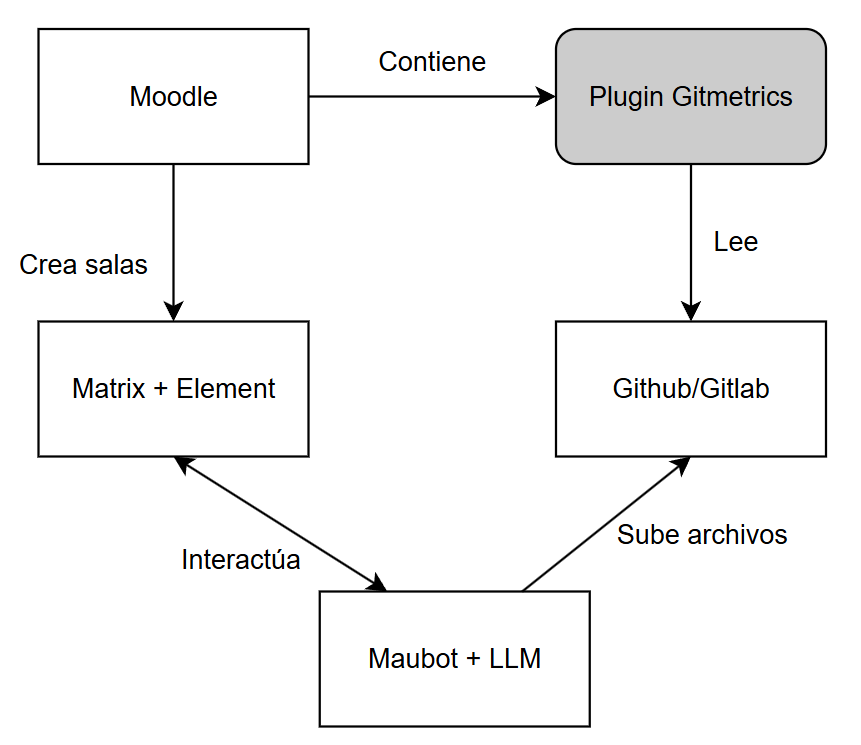
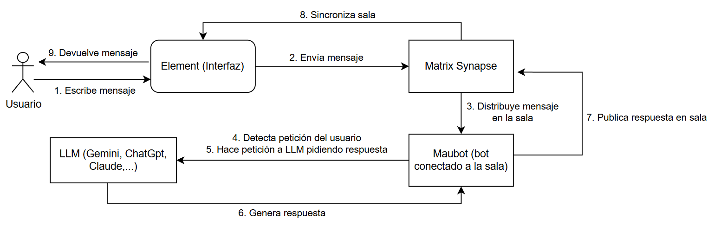

# pluginMoodleMetricas - Plataforma de Evaluación de Bases de Conocimiento e Integración con Matrix en Moodle

Entorno integral formado por el plugin de bloque Moodle **`block_gitmetrics`** y un stack de comunicación colaborativa que analiza repositorios de **GitHub y GitLab** bajo el estándar **OKF (Open Knowledge Framework)** e integra salas de chat **Matrix (Synapse + Element)** sincronizadas nativamente con cada asignatura del LMS.

### Diagramas
---

**Diagrama de Arquitectura:**



**Diagrama de Interacción:**




---

## Índice de Contenidos

1. [Ejecutar la Documentación (MkDocs)](#1-ejecutar-la-documentación-mkdocs)
2. [Credenciales del Entorno](#2-credenciales-del-entorno)
3. [Arquitectura General](#3-arquitectura-general)
4. [Inventario Completo de Ficheros](#4-información-sobre-cada-directorio)
    - [Raíz del Proyecto](#raíz-del-proyecto)
    - [gitmetrics/ — Plugin Moodle block_gitmetrics](#gitmetrics--plugin-moodle-block_gitmetrics)
    - [moodle-matrix-dev/ — Stack Docker](#moodle-matrix-dev--stack-docker)
5. [Requisitos Previos](#5-requisitos-previos)
6. [Instalación](#6-instalación)
    - [Opción A: Instalación Automática (Recomendada)](#opción-a-instalación-automática-recomendada)
    - [Opción B: Instalación Manual Paso a Paso](#opción-b-instalación-manual-paso-a-paso)
7. [Seguridad: Gestión de Credenciales](#7-seguridad-gestión-de-credenciales)
8. [Cambiar o Reconectar el Repositorio Git](#8-cambiar-o-reconectar-el-repositorio-git)
9. [Guía de Uso: Secciones de Métricas](#9-guía-de-uso-secciones-de-métricas)
10. [Integración con Matrix y el Bot Git](#10-integración-con-matrix-y-el-bot-git)
    - [Crear el usuario administrador de Matrix](#crear-el-usuario-administrador-de-matrix)
    - [Conectar Moodle con Matrix](#conectar-moodle-con-matrix)
    - [Las salas de chat (Automatización y Desactivación)](#las-salas-de-chat-automatización-y-desactivación)
    - [Comandos del bot en la sala Matrix](#comandos-del-bot-en-la-sala-matrix)
11. [Integración con Obsidian](#11-integración-con-obsidian)
12. [Configuración de Proveedores Git](#12-configuración-de-proveedores-git)
13. [Gestión de Contenedores Docker](#13-gestión-de-contenedores-docker)

---

## 1. Ejecutar la Documentación (MkDocs)

Para ver la documentación técnica completa del proyecto sin necesidad de instalar dependencias locales, puedes levantar un servidor de MkDocs usando Docker:

```bash
docker run --rm -it -p 8000:8000 -v ${PWD}:/docs squidfunk/mkdocs-material
```

*(Si usas la terminal de Windows en vez de WSL o Linux, usa `-v "%cd%":/docs` en su lugar).*

La documentación estará disponible en: `http://127.0.0.1:8000/`

---

## 2. Credenciales del Entorno

| Servicio | URL | Usuario | Contraseña |
|:---|:---|:---|:---|
| **Moodle 4.2+** | `http://localhost:8000` | `admin` | `adminpass123` |
| **Element Web (Matrix)** | `http://localhost:8081` | `admin` | `adminpass123` |
| **Maubot (Bot Manager)** | `http://localhost:29316/_matrix/maubot/` | Ver `maubot-data/config.yaml` | Ver `maubot-data/config.yaml` |
| **MariaDB (Moodle DB)** | Interno Docker (`moodle-mariadb:3306`) | `bn_moodle` | `moodle_db_pass` |
| **Synapse Homeserver** | `http://localhost:8008` | — | — |
| **Ollama (LLM local)** | `http://localhost:11434` | — | — |

> **ADVERTENCIA**: Cambiar las credenciales por defecto antes de exponer el entorno en una red distinta a `localhost`. Las contraseñas por defecto son para desarrollo y despliegue local únicamente.

---

## 3. Arquitectura General

```
pluginMoodleMetricas/
├── instalar.sh              ← Script para el despliegue
├── configurar_git.sh        ← Script para el cambio de
                                 repositorio Git
├── gitmetrics/              ← Plugin PHP para Moodle
                                 (block_gitmetrics
└── moodle-matrix-dev/       ← Stack Docker con servicios
    ├── docker-compose.yml   ← Define los contenedores
    ├── synapse-data/        ← Datos persistentes
    ├── github-bot-plugin/   ← Bot de Matrix (Maubot)
    └── usuarios/            ← Scripts CLI de gestión de 
                                 usuarios Moodle
```

**Contenedores Docker del stack:**

| Contenedor | Imagen | Puerto | Función |
|:---|:---|:---|:---|
| `moodle-app` | `bitnamilegacy/moodle:latest` | `8000` | LMS Moodle 4.2+ con el plugin instalado |
| `moodle-mariadb` | `mariadb:10.11` | `3306` (interno) | Base de datos relacional de Moodle |
| `matrix-synapse` | `matrixdotorg/synapse:latest` | `8008` | Homeserver Matrix federado |
| `element-web` | `vectorim/element-web:latest` | `8081` | Cliente web Matrix |
| `maubot` | Custom (`Dockerfile.maubot`) | `29316` | Bot de Matrix con integración Git |
| `ollama` | `ollama/ollama:latest` | `11434` | LLM local para asistencia del bot |

---

## 4. Información sobre cada directorio

- **`Raíz del proyecto (/)`**: Contiene los scripts principales de despliegue (`instalar.sh` y `configurar_git.sh`). Son los encargados de levantar toda la infraestructura de contenedores, configurar las conexiones de repositorios e inicializar los servicios.
- **`gitmetrics/`**: Es el código fuente del plugin de Moodle (`block_gitmetrics`). Aquí se aloja la lógica en PHP para extraer métricas de GitHub/GitLab, procesar los documentos Markdown bajo el estándar OKF y mostrar las estadísticas.
- **`moodle-matrix-dev/`**: Contiene el fichero de Docker Compose que enlaza Moodle con el servidor de chat, además de los siguientes subdirectorios:
  - **`synapse-data/`**: Carpeta donde se guardan de forma permanente los datos, archivos y base de datos del servidor Matrix.
  - **`github-bot-plugin/`**: Contiene el código y la configuración del bot Maubot.
  - **`usuarios/`**: Para gestionar usuarios de Moodle usando la línea de comandos.
---
## 5. Requisitos Previos

| Requisito | Versión mínima | Notas |
|:---|:---|:---|
| **Docker Desktop** | 4.x+ | Debe estar activo con el motor Docker en ejecución |
| **WSL 2 (Ubuntu)** | Ubuntu 20.04+ | Solo en Windows. Los scripts `.sh` se ejecutan en WSL |
| **Python 3** | 3.8+ | Necesario en el host para que `configurar_git.sh` edite el YAML |
| **Git** | 2.x+ | Para clonar el repositorio |
| **Bash** | 4.x+ | Para ejecutar `instalar.sh` y `configurar_git.sh` |

> **IMPORTANTE**: En Windows, todos los comandos `bash` y `docker` se deben ejecutar desde una terminal **WSL 2 (Ubuntu)**, no desde PowerShell ni CMD.

---

## 6. Instalación

### Opción A: Instalación Automática (Recomendada)

Clona el repositorio y ejecuta el script de instalación desde WSL (Ubuntu) indicando la URL y el token de acceso a tu repositorio Git:

```bash
# Acceder al directorio del proyecto en WSL
cd pluginMoodleMetricas

# Despliegue completo con GitLab
./instalar.sh --url="https://gitlab.com/tu-usuario/tu-repo" --token="glpat-xxxxxxxxxxxxxxxx"

# Despliegue completo con GitHub
./instalar.sh --url="https://github.com/tu-usuario/tu-repo" --token="ghp_xxxxxxxxxxxxxxxx"

# Despliegue sin repositorio (métricas inactivas hasta configurarlas manualmente)
./instalar.sh
```

El script realiza automáticamente estos 8 pasos:

1. Levanta los contenedores Docker (`docker compose up -d`)
2. Espera a que Moodle esté operativo (polling con reintentos)
3. Copia el plugin `gitmetrics/` al contenedor `moodle-app`
4. Ajusta permisos del plugin y del volumen Obsidian
5. Instala/actualiza el plugin en la BD de Moodle (`upgrade.php`)
6. Crea la asignatura "Panel de Métricas y BdC"
7. Configura la integración Matrix (Synapse + Element)
8. Sincroniza el repositorio Git y habilita la integración Obsidian

Al finalizar, el entorno estará accesible en:

```
Moodle:   http://localhost:8000   → Usuario: admin
                                    Contraseña: adminpass123
Matrix:   http://localhost:8081   → Usuario: admin
                                    Contraseña: adminpass123
Maubot:   http://localhost:29316/_matrix/maubot/
```

---

### Opción B: Instalación Manual Paso a Paso

```bash
# 1. Levantar contenedores
cd pluginMoodleMetricas/moodle-matrix-dev
docker compose up -d

# 2. Esperar a Moodle (ver logs hasta "** Moodle setup finished! **")
docker compose logs -f moodle

# 3. Copiar el plugin al contenedor
docker cp ../gitmetrics moodle-app:/bitnami/moodle/blocks/gitmetrics

# 4. Ajustar permisos
docker exec --user root moodle-app chown -R daemon:daemon /bitnami/moodle/blocks/gitmetrics
docker exec --user root moodle-app chmod -R 755 /bitnami/moodle/blocks/gitmetrics

# 5. Registrar el plugin en la BD de Moodle
docker exec --user daemon moodle-app php /bitnami/moodle/admin/cli/upgrade.php --non-interactive

# 6. Crear la asignatura dedicada
docker exec --user daemon moodle-app php /bitnami/moodle/blocks/gitmetrics/cli/setup_course.php

# 7. Configurar Matrix
docker exec --user daemon moodle-app php /bitnami/moodle/blocks/gitmetrics/cli/setup_matrix.php

# 8. Limpiar cachés
docker exec --user daemon moodle-app php /bitnami/moodle/admin/cli/purge_caches.php
```

---

---

## 7. Seguridad: Gestión de Credenciales

Este proyecto utiliza un sistema de **ficheros plantilla (`.example`)** para evitar que contraseñas, tokens y claves criptográficas se suban al repositorio Git.

### Cómo funciona

Cada fichero que contiene credenciales tiene una versión `.example` con valores de ejemplo. Los ficheros reales (con tus credenciales) están excluidos del repositorio mediante `.gitignore`.

| Fichero real (excluido de Git) | Plantilla versionada (`.example`) |
|:---|:---|
| `moodle-matrix-dev/.env` | `.env.example` |
| `moodle-matrix-dev/synapse-data/homeserver.yaml` | `homeserver.yaml.example` |
| `moodle-matrix-dev/github-bot-plugin/github-bot-plugin/base-config.yaml` | `base-config.yaml.example` |
| `moodle-matrix-dev/github-bot-plugin/maubot-data/config.yaml` | `config.yaml.example` |

### Primer uso (tras clonar el repositorio)

`instalar.sh` **copia automáticamente** cada plantilla `.example` a su fichero real la primera vez que se ejecuta. Si el fichero real ya existe, no lo sobrescribe (para no perder credenciales que ya hayas configurado).

Si prefieres hacerlo manualmente antes de ejecutar `instalar.sh`:

```bash
# Desde la raíz del proyecto
cp moodle-matrix-dev/.env.example moodle-matrix-dev/.env
cp moodle-matrix-dev/synapse-data/homeserver.yaml.example moodle-matrix-dev/synapse-data/homeserver.yaml
cp moodle-matrix-dev/github-bot-plugin/github-bot-plugin/base-config.yaml.example moodle-matrix-dev/github-bot-plugin/github-bot-plugin/base-config.yaml
cp moodle-matrix-dev/github-bot-plugin/maubot-data/config.yaml.example moodle-matrix-dev/github-bot-plugin/maubot-data/config.yaml
```

Después, edita cada fichero y sustituye los valores de ejemplo (`TU_TOKEN_AQUI`, `GENERA_UN_SECRETO_ALEATORIO_AQUI`, etc.) por tus valores reales.

---

## 8. Cambiar o Reconectar el Repositorio Git

Para cambiar el repositorio (nueva URL, nuevo token, otra rama o pasar de GitLab a GitHub) sin reinstalar nada:

```bash
cd pluginMoodleMetricas

# Sintaxis completa
./configurar_git.sh --url="<URL>" --token="<TOKEN>" --branch="<RAMA>"

# Ejemplo con GitLab (rama main por defecto)
./configurar_git.sh --url="https://gitlab.com/<tu_usuario>/<tu_repo>" --token="glpat-xxxxxxxxxxxxxxxx"

# Ejemplo con GitHub, rama específica
./configurar_git.sh --url="https://github.com/<tu_usuario>/<tu_repo>" --token="ghp_xxxxxxxxxxxxxxxx" --branch="develop"

# Modo interactivo (sin argumentos, solicita URL y token)
./configurar_git.sh
```

Este único comando actualiza simultáneamente:
- `base-config.yaml` del bot Maubot (fichero en disco)
- BD interna de Maubot (SQLite dentro del contenedor)
- Contenedor `maubot` (reinicio automático)
- Configuración de Moodle (`mdl_config_plugins`)
- Integración con Obsidian

---

## 9. Guía de Uso: Secciones de Métricas

[Ver la Guía de Uso detallada de las Métricas en la documentación del plugin](./gitmetrics/#uso)

---

## 10. Integración con Matrix y el Bot Git

[Ver los pasos de Integración con Matrix y Bot Git en la documentación del entorno](./moodle-matrix-dev/#matrix)

---

## 11. Integración con Obsidian

[Ver la configuración de Integración con Obsidian en la documentación del plugin](./gitmetrics/#obsidian)

---

## 12. Configuración de Proveedores Git

[Ver la Configuración de Proveedores Git en la documentación del entorno](./moodle-matrix-dev/#git)

---

## 13. Gestión de Contenedores Docker

[Ver los comandos de Gestión de Contenedores Docker en la documentación del entorno](./moodle-matrix-dev/#docker)
