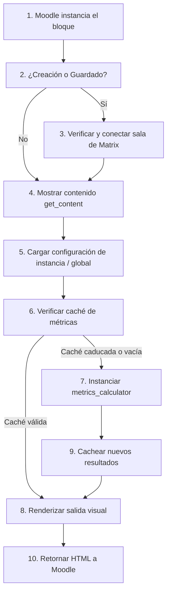

Crear archivo en: `docs/gitmetrics/block_gitmetrics.md`

# Bloque `block_gitmetrics`

Ubicación: `block_gitmetrics.php`

--8<-- "gitmetrics/block_gitmetrics.php:file_desc"

## Diagrama de Flujo Principal



### Detalle de los Pasos del Flujo

1. **[PASO 1] Instancia del bloque:** El usuario (o Moodle) carga un bloque Gitmetrics en una página de curso.
2. **[PASO 2] Hooks de guardado:** Si el evento es la creación de la instancia (`instance_create`) o el guardado de su configuración (`instance_config_save`).
3. **[PASO 3] Conexión Matrix:** Se ejecuta el helper de Matrix para garantizar que el curso tiene un grupo en Synapse asociado, e invitar al bot de recolección de métricas.
4. **[PASO 4] Mostrar contenido:** Cuando Moodle necesita pintar el bloque, invoca `get_content`.
5. **[PASO 5] Cargar configuración:** Se determinan la URL del repositorio y el proveedor (GitHub o GitLab), dando prioridad a la configuración de la instancia local sobre la global.
6. **[PASO 6] Verificar caché:** Se consulta `metrics_cache` usando el block instance ID. Si el usuario forzó el refresco en los ajustes del bloque, se invalida primero.
7. **[PASO 7] Calcular:** Si la caché no existe o expiró, se instancia `metrics_calculator` con el token de acceso correspondiente y se calculan las métricas completas en tiempo real.
8. **[PASO 8] Caché:** Se guardan los resultados obtenidos en la base de datos local de Moodle.
9. **[PASO 9] Renderizar:** Se delega a la clase `renderer` pintar la tabla visual con los indicadores extraídos.
10. **[PASO 10] Retornar HTML:** Se envía el contenido construido de regreso al frame de Moodle para el usuario final.

## Funciones Principales

### `init`
Inicializa los metadatos básicos del bloque en la memoria de Moodle, especificando su nombre localizado.

```php
--8<-- "gitmetrics/block_gitmetrics.php:init"
```

### `instance_create`
Hook de Moodle. Se dispara inmediatamente al añadir una instancia nueva al curso. Dispara la sincronización con Matrix si está disponible.

```php
--8<-- "gitmetrics/block_gitmetrics.php:instance_create"
```

### `instance_config_save`
Hook de Moodle. Se dispara cada vez que el usuario guarda cambios en el formulario del bloque. También sincroniza con Matrix.

```php
--8<-- "gitmetrics/block_gitmetrics.php:instance_config_save"
```

### `get_content`
Corazón lógico del bloque de interfaz gráfica. Orquesta la recolección de los parámetros, el refresco de cachés, llama al calculador de métricas y finalmente delega el pintado visual en el renderizador.

```php
--8<-- "gitmetrics/block_gitmetrics.php:get_content"
```
