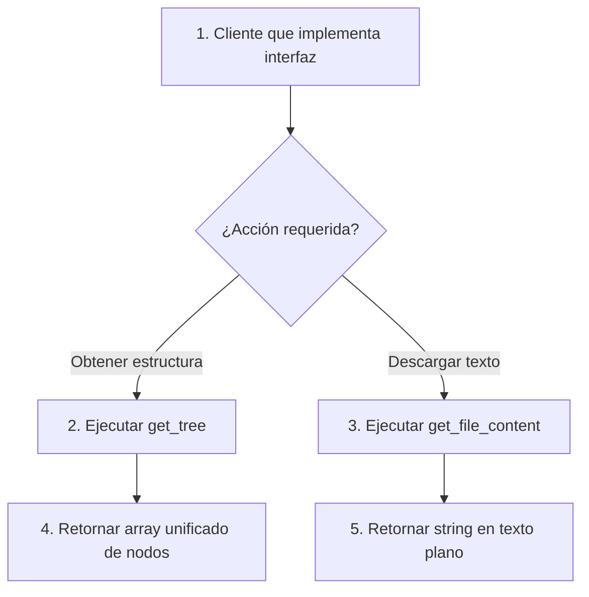

Crear archivo en: `docs/gitmetrics/classes/git_provider_interface.md`

# Interfaz `git_provider_interface`

Ubicación: `classes/git_provider_interface.php`

--8<-- "gitmetrics/classes/git_provider_interface.php:class_desc"

## Diagrama de Flujo Principal



### Detalle de los Pasos del Flujo

1. **[PASO 1] Cliente instanciado:** Una clase que implemente esta interfaz (`github_client` o `gitlab_client`) es utilizada en el sistema (por ejemplo, en `metrics_calculator`).
2. **[PASO 2] Ejecutar get_tree:** Se impone a la clase la obligación de poseer el método para extraer el árbol completo de un repositorio.
3. **[PASO 3] Ejecutar get_file_content:** Se impone la obligación de poseer un método que descargue el código raw de un fichero del repositorio.
4. **[PASO 4] Retorno de array:** Se garantiza contractualmente que el método de árbol retornará una lista estandarizada (`array`) independiente del proveedor subyacente.
5. **[PASO 5] Retorno de string:** Se garantiza que la descarga del archivo retornará un tipo de dato cadena (`string`).

## Funciones Principales

### `get_tree`
Firma obligatoria para obtener el árbol recursivo del repositorio. Define qué argumentos se deben pasar (*owner*, *repo*, *branch*) y qué se debe retornar.

```php
--8<-- "gitmetrics/classes/git_provider_interface.php:get_tree"
```

### `get_file_content`
Firma obligatoria para descargar el contenido raw (texto plano) de un fichero. Define los parámetros necesarios (añadiendo el *path* relativo) y su retorno.

```php
--8<-- "gitmetrics/classes/git_provider_interface.php:get_file_content"
```
