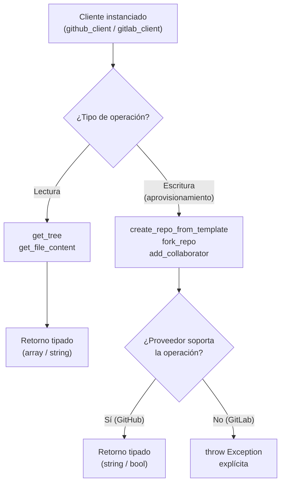

# Interfaz `git_provider_interface`

Ubicación: `gitmetrics/classes/git_provider_interface.php`

```php
--8<-- "gitmetrics/classes/git_provider_interface.php:class_desc"
```

## Diagrama de Flujo


```mermaid
graph TD
    A["Cliente instanciado\n(github_client / gitlab_client)"] --> B{"¿Tipo de operación?"}
    B -->|"Lectura"| C["get_tree\nget_file_content"]
    B -->|"Escritura\n(aprovisionamiento)"| D["create_repo_from_template\nfork_repo\nadd_collaborator"]
    C --> E["Retorno tipado\n(array / string)"]
    D --> F{"¿Proveedor soporta\nla operación?"}
    F -->|"Sí (GitHub)"| G["Retorno tipado\n(string / bool)"]
    F -->|"No (GitLab)"| H["throw Exception\nexplícita"]
```

## Métodos de lectura

### `get_tree`

Firma obligatoria para obtener el árbol recursivo del repositorio.

```php
--8<-- "gitmetrics/classes/git_provider_interface.php:get_tree"
```

### `get_file_content`

Firma obligatoria para descargar el contenido raw de un fichero.

```php
--8<-- "gitmetrics/classes/git_provider_interface.php:get_file_content"
```

## Métodos de escritura (aprovisionamiento, Paso 2)

Estos tres métodos amplían la interfaz para el flujo de creación de repos de alumno.
Los proveedores que no los soporten **deben** lanzar `\Exception` explícita — nunca dejar el cuerpo vacío.

### `create_repo_from_template`

Crea un repo nuevo en `$new_namespace` a partir de una plantilla. En GitHub usa
`POST /repos/{template_owner}/{template_repo}/generate`.

```php
--8<-- "gitmetrics/classes/git_provider_interface.php:create_repo_from_template"
```

### `fork_repo`

Hace fork de un repo existente y lo renombra. Alternativa a `create_repo_from_template`
cuando el repo origen no está marcado como *Template repository*.

```php
--8<-- "gitmetrics/classes/git_provider_interface.php:fork_repo"
```

### `add_collaborator`

Añade un usuario como colaborador con el rol indicado. El rol semántico
(`guest` / `developer` / `maintainer` / `owner`) se traduce internamente
a los permisos de cada proveedor.

```php
--8<-- "gitmetrics/classes/git_provider_interface.php:add_collaborator"
```

## Convención de implementación

| Proveedor | Lectura | Escritura |
|---|---|---|
| `github_client` | ✅ Implementado | ✅ Implementado (ver [github_client.md](github_client.md)) |
| `gitlab_client` | ✅ Implementado | ⚠️ `throw \Exception` explícita (ver [gitlab_client.md](gitlab_client.md)) |

> [!NOTE]
> La decisión de no implementar los métodos de escritura en GitLab es de **alcance**, no un olvido.
> Ver la sección "Por qué GitLab queda con excepción explícita" en [github_client.md](github_client.md).
