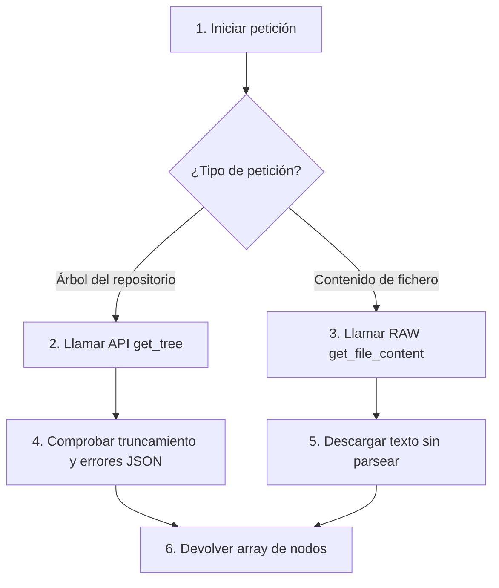

Crear archivo en: `docs/gitmetrics/classes/github_client.md`

# Clase `github_client`

Ubicación: `classes/github_client.php`

--8<-- "gitmetrics/classes/github_client.php:class_desc"

## Diagrama de Flujo Principal



### Detalle de los Pasos del Flujo

1. **[PASO 1] Iniciar petición:** El sistema invoca al cliente solicitando la descarga de información de un repositorio en GitHub.
2. **[PASO 2] Llamar API get_tree:** Para descargar la estructura del repositorio se hace una petición REST a la API de GitHub (`/git/trees/`).
3. **[PASO 3] Llamar RAW get_file_content:** Para descargar el contenido de un fichero Markdown se hace una petición HTTP a `raw.githubusercontent.com`.
4. **[PASO 4] Comprobar truncamiento:** En la petición REST se decodifica el JSON y se verifica que GitHub no haya truncado la respuesta por ser un repositorio demasiado masivo.
5. **[PASO 5] Descargar texto:** En las peticiones RAW simplemente se extrae el texto plano del documento sin procesamiento adicional.
6. **[PASO 6] Devolver array/texto:** Se retorna el resultado esperado a la clase orquestadora (`metrics_calculator`).

## Funciones Principales

### `get_tree`
Obtiene el árbol recursivo de ficheros de un repositorio a través de la API oficial de GitHub.

```php
--8<-- "gitmetrics/classes/github_client.php:get_tree"
```

### `get_file_content`
Descarga el contenido raw (texto puro) de un fichero Markdown específico utilizando el subdominio rawusercontent de GitHub.

```php
--8<-- "gitmetrics/classes/github_client.php:get_file_content"
```
