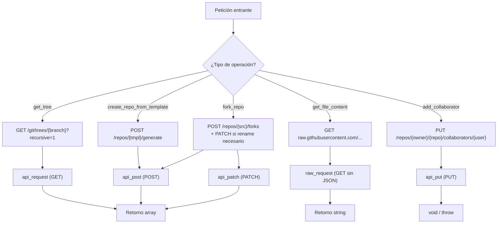

# Clase `github_client`

Ubicación: `gitmetrics/classes/github_client.php`

```php
--8<-- "gitmetrics/classes/github_client.php:class_desc"
```

## Diagrama de Flujo


```mermaid
graph TD
    A["Petición entrante"] --> B{"¿Tipo de operación?"}
    B -->|"get_tree"| C["GET /git/trees/{branch}?recursive=1"]
    B -->|"get_file_content"| D["GET raw.githubusercontent.com/..."]
    B -->|"create_repo_from_template"| E["POST /repos/{tmpl}/generate"]
    B -->|"fork_repo"| F["POST /repos/{src}/forks\n+ PATCH si rename necesario"]
    B -->|"add_collaborator"| G["PUT /repos/{owner}/{repo}/collaborators/{user}"]

    C --> H["api_request (GET)"]
    D --> I["raw_request (GET sin JSON)"]
    E --> J["api_post (POST)"]
    F --> J
    F --> K["api_patch (PATCH)"]
    G --> L["api_put (PUT)"]

    H --> M["Retorno array"]
    I --> N["Retorno string"]
    J --> M
    K --> M
    L --> O["void / throw"]
```

## Métodos de lectura

### `get_tree`

Árbol recursivo via la API de Trees de GitHub.

```php
--8<-- "gitmetrics/classes/github_client.php:get_tree"
```

### `get_file_content`

Descarga raw desde `raw.githubusercontent.com`.

```php
--8<-- "gitmetrics/classes/github_client.php:get_file_content"
```

## Métodos de escritura (aprovisionamiento, Paso 2)

### `create_repo_from_template`

Usa `POST /repos/{template_owner}/{template_repo}/generate` para crear el repo
personal del alumno a partir de la plantilla configurada en los ajustes globales.
Requiere el media-type `application/vnd.github.baptiste-preview+json` (aún en preview
en la API de GitHub a fecha de implementación).

```php
--8<-- "gitmetrics/classes/github_client.php:create_repo_from_template"
```

### `fork_repo`

Usa `POST /repos/{owner}/{repo}/forks` y, si el nombre por defecto difiere del solicitado,
un `PATCH /repos/{namespace}/{fork_name}` para renombrar. La API de GitHub crea forks de
forma asíncrona (HTTP 202); el caller debe tener en cuenta que el repo puede no estar
disponible inmediatamente.

```php
--8<-- "gitmetrics/classes/github_client.php:fork_repo"
```

### `add_collaborator`

Usa `PUT /repos/{owner}/{repo}/collaborators/{username}`. HTTP 201 = invitación enviada,
HTTP 204 = ya era colaborador. El rol semántico se mapea a GitHub permissions:

| Rol | GitHub permission |
|---|---|
| `guest` / `reporter` | `pull` |
| `developer` | `push` |
| `maintainer` | `maintain` |
| `owner` | `admin` |

```php
--8<-- "gitmetrics/classes/github_client.php:add_collaborator"
```

## Por qué GitLab queda con excepción explícita (no implementado)

Esta es una **decisión de alcance**, no un olvido:

1. **No hay equivalente en GitLab** para `POST .../generate` (crear desde plantilla). GitLab solo soporta fork, que copia el historial completo e impide personalizar el contenido inicial.
2. **El proveedor de escritura es GitHub** por decisión explícita del Paso 0: `template_provider = 'github'`. GitLab sigue siendo el proveedor de *lectura* de métricas (el repo de trabajo real puede estar en GitLab), pero la creación de repos de alumno pasa por GitHub.
3. **Fallo explícito vs. fallo silencioso**: dejar el cuerpo vacío devolvería `''` o `false` sin aviso; lanzar `\Exception` garantiza que cualquier llamada accidental a `gitlab_client::create_repo_from_template()` se detecta inmediatamente en los logs, con un mensaje orientado al diagnóstico.
4. **Ruta de implementación futura**: si en algún momento se necesita soporte GitLab, los stubs de `gitlab_client.php` ya indican qué endpoint usar (`POST /api/v4/projects/{id}/fork` + PATCH para renombrar, `POST /api/v4/projects/{id}/members` para colaboradores).

## Scopes del token requeridos

Ver tabla completa en [provisioning-repos.md](../provisioning-repos.md#3-credenciales-necesarias-token-de-github).

| Scope | Cuándo |
|---|---|
| `repo` | Siempre — crear repos privados, leer/escribir contenido |
| `admin:org` → `write:org` | Solo si `target_namespace` es una organización |
| `delete_repo` | Opcional — para limpieza/RGPD |
