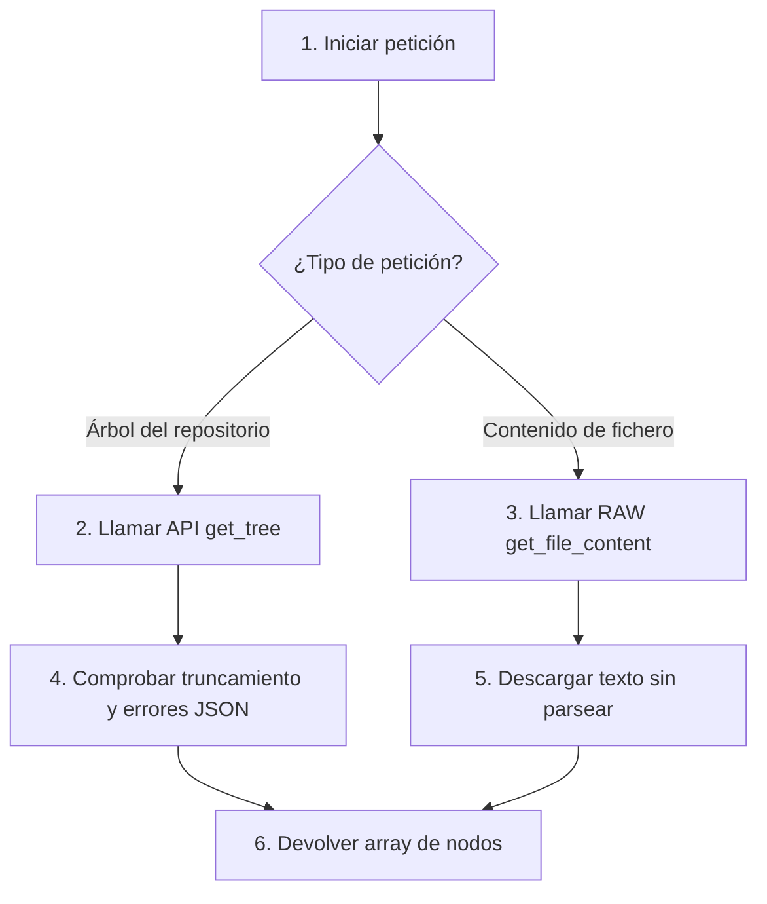

Crear archivo en: `docs/gitmetrics/classes/github_client.md`

# Clase `github_client`

Ubicación: `classes/github_client.php`

```python
Cliente HTTP para la API de GitHub y raw.githubusercontent.com.

Usa la clase curl de Moodle (lib/filelib.php) para respetar la
configuración de proxy del servidor y las restricciones de red.

Endpoints utilizados:
  - GET /repos/{owner}/{repo}/git/trees/{branch}?recursive=1
    → árbol completo de ficheros y directorios.
  - GET https://raw.githubusercontent.com/{owner}/{repo}/{branch}/{path}
    → contenido raw de cada fichero Markdown.
```

## Diagrama de Flujo Principal


```mermaid
graph TD
    A["1. Iniciar petición"] --> B{"¿Tipo de petición?"}
    B -->|"Árbol del repositorio"| C["2. Llamar API get_tree"]
    B -->|"Contenido de fichero"| D["3. Llamar RAW get_file_content"]
    C --> E["4. Comprobar truncamiento y errores JSON"]
    D --> F["5. Descargar texto sin parsear"]
    E --> G["6. Devolver array de nodos"]
    F --> G
```

### Detalle de los Pasos del Flujo

1. **[PASO 1] Iniciar petición:** El sistema invoca al cliente solicitando la descarga de información de un repositorio en GitHub.
2. **[PASO 2] Llamar API get_tree:** Para descargar la estructura del repositorio se hace una petición REST a la API de GitHub (`/git/trees/`).
3. **[PASO 3] Llamar RAW get_file_content:** Para descargar el contenido de un fichero Markdown se hace una petición HTTP a `raw.githubusercontent.com`.
4. **[PASO 4] Comprobar truncamiento:** En la petición REST se decodifica el JSON y se verifica que GitHub no haya truncado la respuesta por ser un repositorio demasiado masivo.
5. **[PASO 5] Descargar texto:** En las peticiones RAW simplemente se extrae el texto plano del documento sin procesamiento adicional.
6. **[PASO 6] Devolver array/texto:** Se retorna el resultado esperado a la clase coordinadora (`metrics_calculator`).

## Funciones Principales

### `get_tree`
Obtiene el árbol recursivo de ficheros de un repositorio a través de la API oficial de GitHub.

```php
```python
public function get_tree(string $owner, string $repo, string $branch): array {
    $url      = self::API_BASE . "/repos/{$owner}/{$repo}/git/trees/{$branch}?recursive=1";
    $response = $this->api_request($url);

    if (!isset($response['tree'])) {
        throw new \Exception(get_string('error_branch', 'block_gitmetrics'));
    }

    // GitHub trunca árboles muy grandes; informar al caller
    if (!empty($response['truncated'])) {
        debugging('block_gitmetrics: el árbol del repo fue truncado por la API (> 100 000 elementos).', DEBUG_DEVELOPER);
    }

    return $response['tree'];
}
// 
```


### `get_file_content`
Descarga el contenido raw (texto puro) de un fichero Markdown específico utilizando el subdominio rawusercontent de GitHub.

```php
```python
public function get_file_content(string $owner, string $repo, string $path, string $branch): string {
    // Codificamos cada segmento del path por separado para no romper las '/'
    $encoded_path = implode('/', array_map('rawurlencode', explode('/', $path)));
    $url = self::RAW_BASE . "/{$owner}/{$repo}/{$branch}/{$encoded_path}";

    return $this->raw_request($url);
}
// 
```

