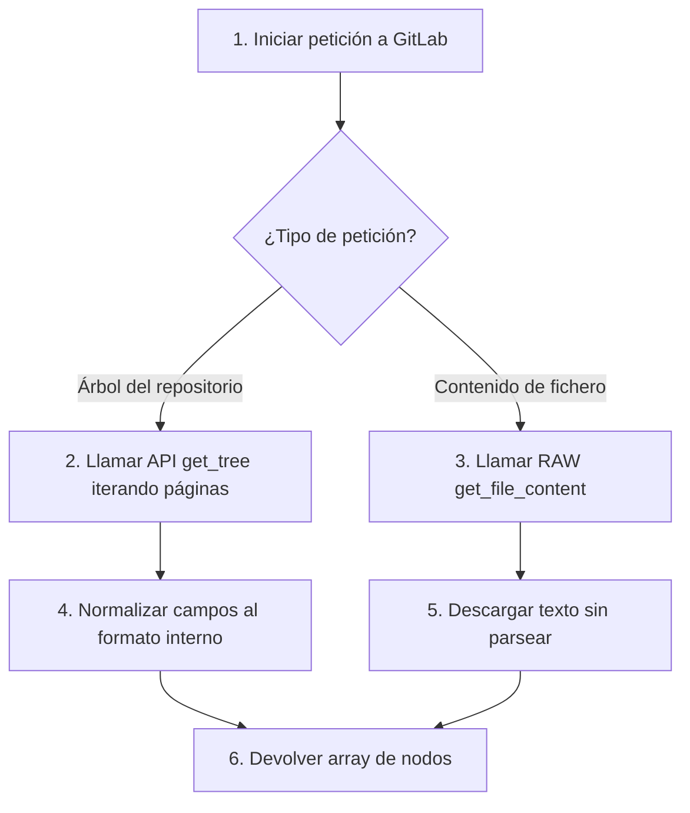

Crear archivo en: `docs/gitmetrics/classes/gitlab_client.md`

# Clase `gitlab_client`

Ubicación: `classes/gitlab_client.php`

--8<-- "gitmetrics/classes/gitlab_client.php:class_desc"

## Diagrama de Flujo Principal



### Detalle de los Pasos del Flujo

1. **[PASO 1] Iniciar petición:** El sistema invoca al cliente solicitando la descarga de información de un repositorio en una instancia de GitLab.
2. **[PASO 2] Llamar API paginada:** A diferencia de GitHub, GitLab API v4 devuelve los árboles paginados (100 elementos por página). El método realiza peticiones en bucle hasta descargar todos los nodos.
3. **[PASO 3] Llamar RAW get_file_content:** Para descargar el contenido de un fichero Markdown se hace una petición HTTP directa al endpoint `/raw` de ese fichero en la API.
4. **[PASO 4] Normalizar campos:** Como GitLab devuelve una estructura distinta a GitHub, se mapean y normalizan los campos (como `id` a `sha`, o `type`) para que la calculadora de métricas trabaje siempre con un array homogéneo independiente del proveedor.
5. **[PASO 5] Descargar texto:** Las peticiones RAW extraen el texto plano del documento directamente.
6. **[PASO 6] Devolver array/texto:** Se retorna el resultado esperado unificado a la clase orquestadora (`metrics_calculator`).

## Funciones Principales

### `get_tree`
Obtiene el árbol recursivo de ficheros de un repositorio. Gestiona internamente la paginación de la API de GitLab (que devuelve de 100 en 100).

```php
--8<-- "gitmetrics/classes/gitlab_client.php:get_tree"
```

### `get_file_content`
Descarga el contenido raw de un fichero Markdown específico utilizando la API de GitLab (`/files/path/raw`).

```php
--8<-- "gitmetrics/classes/gitlab_client.php:get_file_content"
```
