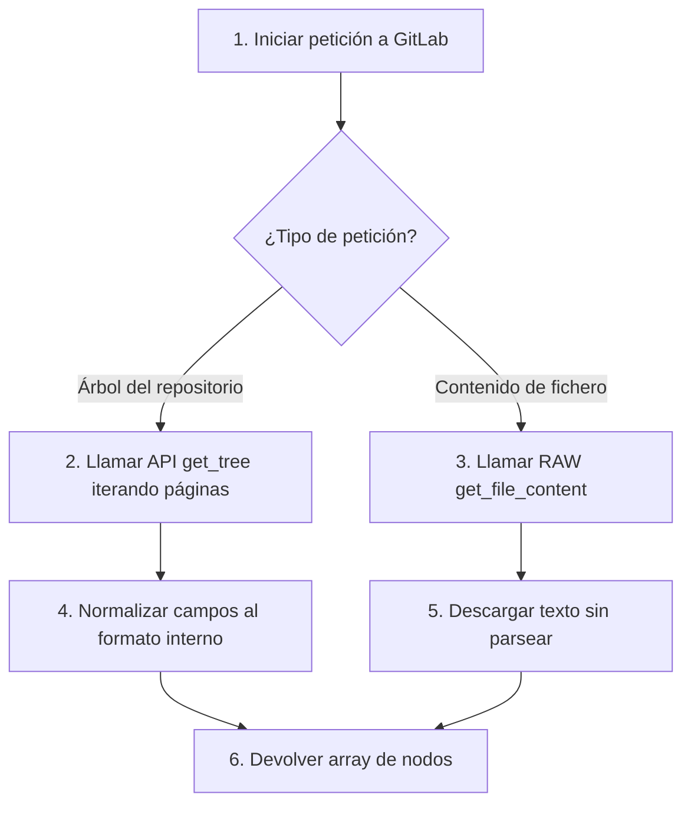

Crear archivo en: `docs/gitmetrics/classes/gitlab_client.md`

# Clase `gitlab_client`

Ubicación: `classes/gitlab_client.php`

```python
Cliente HTTP para la API v4 de GitLab (auto-alojado u OSL).

Compatible con cualquier instancia GitLab: la OSL de tu universidad,
un servidor GitLab en red local o el propio gitlab.com.

Endpoints utilizados:
  - GET /api/v4/projects/{id_encoded}/repository/tree?recursive=true&ref={branch}
    → arbol completo de ficheros y directorios.
  - GET /api/v4/projects/{id_encoded}/repository/files/{path_encoded}/raw?ref={branch}
    → contenido raw de cada fichero Markdown.

Autenticacion:
  - Token personal (PRIVATE-TOKEN) o token de acceso de proyecto.
  - Sin token funciona para repositorios publicos.
```

## Diagrama de Flujo Principal


```mermaid
graph TD
    A["1. Iniciar petición a GitLab"] --> B{"¿Tipo de petición?"}
    B -->|"Árbol del repositorio"| C["2. Llamar API get_tree iterando páginas"]
    B -->|"Contenido de fichero"| D["3. Llamar RAW get_file_content"]
    C --> E["4. Normalizar campos al formato interno"]
    D --> F["5. Descargar texto sin parsear"]
    E --> G["6. Devolver array de nodos"]
    F --> G
```

### Detalle de los Pasos del Flujo

1. **[PASO 1] Iniciar petición:** El sistema invoca al cliente solicitando la descarga de información de un repositorio en una instancia de GitLab.
2. **[PASO 2] Llamar API paginada:** A diferencia de GitHub, GitLab API v4 devuelve los árboles paginados (100 elementos por página). El método realiza peticiones en bucle hasta descargar todos los nodos.
3. **[PASO 3] Llamar RAW get_file_content:** Para descargar el contenido de un fichero Markdown se hace una petición HTTP directa al endpoint `/raw` de ese fichero en la API.
4. **[PASO 4] Normalizar campos:** Como GitLab devuelve una estructura distinta a GitHub, se mapean y normalizan los campos (como `id` a `sha`, o `type`) para que la calculadora de métricas trabaje siempre con un array homogéneo independiente del proveedor.
5. **[PASO 5] Descargar texto:** Las peticiones RAW extraen el texto plano del documento directamente.
6. **[PASO 6] Devolver array/texto:** Se retorna el resultado esperado unificado a la clase coordinadora (`metrics_calculator`).

## Funciones Principales

### `get_tree`
Obtiene el árbol recursivo de ficheros de un repositorio. Gestiona internamente la paginación de la API de GitLab (que devuelve de 100 en 100).

```php
```python
public function get_tree(string $owner, string $repo, string $branch): array {
    $project_id = rawurlencode("{$owner}/{$repo}");
    $nodes      = [];
    $page       = 1;
    $per_page   = 100;

    do {
        $url      = $this->base_url
                  . "/api/v4/projects/{$project_id}/repository/tree"
                  . "?recursive=true&ref=" . rawurlencode($branch)
                  . "&per_page={$per_page}&page={$page}";
        $response = $this->api_request($url);

        if (!is_array($response)) {
            throw new \Exception(get_string('error_branch', 'block_gitmetrics'));
        }

        foreach ($response as $item) {
            // Normalizar al mismo esquema que usa github_client
            $nodes[] = [
                'path' => $item['path']    ?? '',
                'type' => ($item['type'] === 'blob') ? 'blob' : 'tree',
                'size' => $item['id'] ? 0 : 0, // size no viene en el arbol; se recupera en get_file_content
                'sha'  => $item['id']      ?? '',
                'mode' => $item['mode']    ?? '',
            ];
        }

        $page++;
    } while (count($response) === $per_page);

    if (empty($nodes)) {
        throw new \Exception(get_string('error_branch', 'block_gitmetrics'));
    }

    return $nodes;
}
// 
```


### `get_file_content`
Descarga el contenido raw de un fichero Markdown específico utilizando la API de GitLab (`/files/path/raw`).

```php
```python
public function get_file_content(string $owner, string $repo, string $path, string $branch): string {
    $project_id   = rawurlencode("{$owner}/{$repo}");
    $encoded_path = rawurlencode($path);
    $url = $this->base_url
         . "/api/v4/projects/{$project_id}/repository/files/{$encoded_path}/raw"
         . "?ref=" . rawurlencode($branch);

    return $this->raw_request($url);
}
// 
```

