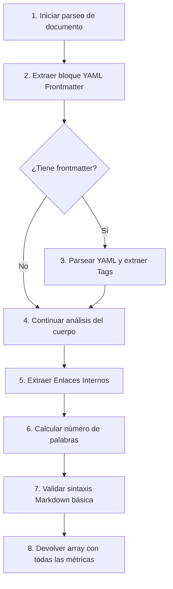

Crear archivo en: `docs/gitmetrics/classes/markdown_parser.md`

# Clase `markdown_parser`

Ubicación: `classes/markdown_parser.php`

--8<-- "gitmetrics/classes/markdown_parser.php:class_desc"

## Diagrama de Flujo Principal



### Detalle de los Pasos del Flujo

1. **[PASO 1] Iniciar parseo:** El sistema invoca al método principal `parse` pasándole el contenido completo en bruto (raw) del archivo Markdown.
2. **[PASO 2] Extraer bloque YAML:** Se utiliza una expresión regular para buscar un bloque inicial encerrado entre líneas con `---`. 
3. **[PASO 3] Parsear YAML y Tags:** Si existe el bloque, se llama a un parseador YAML interno, que valida la sintaxis y recupera las propiedades clave/valor. Posteriormente, se extraen las etiquetas (`tags`).
4. **[PASO 4] Continuar análisis:** El texto restante (excluyendo el bloque YAML inicial) se considera el cuerpo del documento y se usa para las métricas restantes.
5. **[PASO 5] Extraer Enlaces Internos:** Mediante Regex se detectan tanto los enlaces nativos de Markdown como los Wikilinks (`[[enlace]]`), excluyendo deliberadamente cualquier enlace externo HTTP/HTTPS.
6. **[PASO 6] Calcular palabras:** Se realiza una limpieza exhaustiva (borrando bloques de código, URLs, etiquetas HTML y formato Markdown) para contar únicamente las palabras de texto real.
7. **[PASO 7] Validar sintaxis:** Se comprueban errores comunes, como bloques de código sin cerrar, negritas incompletas o HTML anidado roto.
8. **[PASO 8] Devolver array:** Todas las métricas calculadas se consolidan en un único diccionario y se devuelven al orquestador.

## Funciones Principales

### `parse`
Punto de entrada principal. Coordina la ejecución secuencial de todas las extracciones (frontmatter, enlaces, palabras, validación) para un archivo concreto y devuelve el array de resultados.

```php
--8<-- "gitmetrics/classes/markdown_parser.php:parse"
```

### `extract_frontmatter`
Busca el bloque de metadatos YAML al inicio del archivo, lo separa del cuerpo principal y delega su procesamiento al parser.

```php
--8<-- "gitmetrics/classes/markdown_parser.php:extract_frontmatter"
```

### `parse_yaml`
Implementación propia de un parser YAML simplificado para no depender de librerías externas de terceros. Detecta pares clave-valor, arrays inline y listas, generando advertencias en caso de malformación.

```php
--8<-- "gitmetrics/classes/markdown_parser.php:parse_yaml"
```

### `extract_tags`
Función de utilidad que extrae y normaliza las etiquetas desde el frontmatter parseado (soportando alias como `tags`, `tag`, `etiquetas` o `keywords`).

```php
--8<-- "gitmetrics/classes/markdown_parser.php:extract_tags"
```

### `extract_internal_links`
Analiza el cuerpo del documento ignorando bloques de código y extrae todos los enlaces a otras páginas locales, detectando tanto formato Markdown como Wikilinks.

```php
--8<-- "gitmetrics/classes/markdown_parser.php:extract_internal_links"
```

### `count_words`
Calcula el número de palabras netas del documento. Limpia agresivamente todo lo que no sea texto de lectura natural (código, URLs, marcas tipográficas).

```php
--8<-- "gitmetrics/classes/markdown_parser.php:count_words"
```

### `validate_markdown`
Aplica heurísticas simples para detectar errores estructurales graves en el Markdown, como bloques de código sin etiqueta de cierre o corchetes desbalanceados.

```php
--8<-- "gitmetrics/classes/markdown_parser.php:validate_markdown"
```
