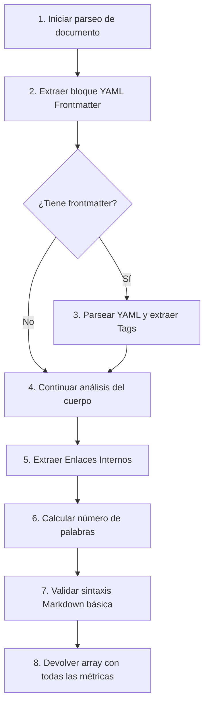

Crear archivo en: `docs/gitmetrics/classes/markdown_parser.md`

# Clase `markdown_parser`

Ubicación: `classes/markdown_parser.php`

```python
Parser de archivos Markdown para la Base de Conocimiento OKF.

Extrae:
 - Frontmatter YAML (entre delimitadores ---)
 - Tags del frontmatter
 - Enlaces internos a otros archivos .md
 - Recuento de palabras
 - Validación básica de formato Markdown
```

## Diagrama de Flujo Principal


```mermaid
graph TD
    A["1. Iniciar parseo de documento"] --> B["2. Extraer bloque YAML Frontmatter"]
    B --> C{"¿Tiene frontmatter?"}
    C -->|"Sí"| D["3. Parsear YAML y extraer Tags"]
    C -->|"No"| E["4. Continuar análisis del cuerpo"]
    D --> E
    E --> F["5. Extraer Enlaces Internos"]
    F --> G["6. Calcular número de palabras"]
    G --> H["7. Validar sintaxis Markdown básica"]
    H --> I["8. Devolver array con todas las métricas"]
```

### Detalle de los Pasos del Flujo

1. **[PASO 1] Iniciar parseo:** El sistema invoca al método principal `parse` pasándole el contenido completo en bruto (raw) del archivo Markdown.
2. **[PASO 2] Extraer bloque YAML:** Se utiliza una expresión regular para buscar un bloque inicial encerrado entre líneas con `---`. 
3. **[PASO 3] Parsear YAML y Tags:** Si existe el bloque, se llama a un parseador YAML interno, que valida la sintaxis y recupera las propiedades clave/valor. Posteriormente, se extraen las etiquetas (`tags`).
4. **[PASO 4] Continuar análisis:** El texto restante (excluyendo el bloque YAML inicial) se considera el cuerpo del documento y se usa para las métricas restantes.
5. **[PASO 5] Extraer Enlaces Internos:** Mediante Regex se detectan tanto los enlaces nativos de Markdown como los Wikilinks (`[[enlace]]`), excluyendo deliberadamente cualquier enlace externo HTTP/HTTPS.
6. **[PASO 6] Calcular palabras:** Se realiza una limpieza exhaustiva (borrando bloques de código, URLs, etiquetas HTML y formato Markdown) para contar únicamente las palabras de texto real.
7. **[PASO 7] Validar sintaxis:** Se comprueban errores comunes, como bloques de código sin cerrar, negritas incompletas o HTML anidado roto.
8. **[PASO 8] Devolver array:** Todas las métricas calculadas se consolidan en un único diccionario y se devuelven al coordinador.

## Funciones Principales

### `parse`
Punto de entrada principal. Coordina la ejecución secuencial de todas las extracciones (frontmatter, enlaces, palabras, validación) para un archivo concreto y devuelve el array de resultados.

```php
```python
public function parse(string $content, string $filepath = ''): array {
    $result = [
        'path'                 => $filepath,
        'has_frontmatter'      => false,
        'is_valid_frontmatter' => false,
        'frontmatter'          => null,
        'frontmatter_errors'   => [],
        'tags'                 => [],
        'body'                 => $content,
        'internal_links'       => [],
        'word_count'           => 0,
        'is_valid_markdown'    => true,
        'markdown_errors'      => [],
        'size_bytes'           => strlen($content),
    ];

    // 1. Extraer frontmatter
    $result = $this->extract_frontmatter($content, $result);

    // 2. Extraer enlaces internos desde el cuerpo
    $result['internal_links'] = $this->extract_internal_links($result['body']);

    // 3. Contar palabras (excluyendo código, links y sintaxis Markdown)
    $result['word_count'] = $this->count_words($result['body']);

    // 4. Validar Markdown básico
    [$valid, $errors] = $this->validate_markdown($result['body']);
    $result['is_valid_markdown'] = $valid;
    $result['markdown_errors']   = $errors;

    return $result;
}
// 
```


### `extract_frontmatter`
Busca el bloque de metadatos YAML al inicio del archivo, lo separa del cuerpo principal y delega su procesamiento al parser.

```php
```python
private function extract_frontmatter(string $content, array $result): array {
    // El frontmatter debe estar al principio del fichero, entre dos '---'
    // Aceptamos también espacios en blanco iniciales.
    if (!preg_match('/^\s*---\s*\n(.*?)\n---\s*(\n|$)/s', $content, $matches)) {
        return $result; // Sin frontmatter
    }

    $result['has_frontmatter'] = true;
    $yaml_block                = $matches[1];

    // El cuerpo empieza después del cierre '---'
    $fm_end           = strpos($content, $matches[0]) + strlen($matches[0]);
    $result['body']   = substr($content, $fm_end);

    // Intentar parsear el YAML
    [$parsed, $errors] = $this->parse_yaml($yaml_block);
    $result['frontmatter_errors'] = $errors;

    if ($parsed !== null && empty($errors)) {
        $result['frontmatter']          = $parsed;
        $result['is_valid_frontmatter'] = true;
        $result['tags']                 = $this->extract_tags($parsed);
    } elseif ($parsed !== null) {
        // Se parseó con advertencias
        $result['frontmatter']          = $parsed;
        $result['is_valid_frontmatter'] = false;
        $result['tags']                 = $this->extract_tags($parsed);
    }

    return $result;
}
// 
```


### `parse_yaml`
Implementación propia de un parser YAML simplificado para no depender de librerías externas de terceros. Detecta pares clave-valor, arrays inline y listas, generando advertencias en caso de malformación.

```php
```python
private function parse_yaml(string $yaml): array {
    $result       = [];
    $errors       = [];
    $lines        = explode("\n", $yaml);
    $current_key  = null;
    $current_indent = 0;

    foreach ($lines as $lineno => $line) {
        // Ignorar líneas vacías y comentarios YAML
        if (trim($line) === '' || ltrim($line)[0] === '#') {
            continue;
        }

        // Detectar ítem de lista (  - valor)
        if (preg_match('/^(\s*)-\s+(.*)$/', $line, $m)) {
            if ($current_key === null) {
                $errors[] = "Line {$lineno}: list item without a key";
                continue;
            }
            if (!is_array($result[$current_key])) {
                $result[$current_key] = [];
            }
            $result[$current_key][] = $this->cast_yaml_value(trim($m[2]));
            continue;
        }

        // Detectar par clave: valor
        if (preg_match('/^(\s*)([\w][\w\-\s]*?)\s*:\s*(.*)$/', $line, $m)) {
            $indent      = strlen($m[1]);
            $key         = trim($m[2]);
            $value_raw   = trim($m[3]);

            // Claves de primer nivel (sin indentación) o sub-claves
            $current_key    = $key;
            $current_indent = $indent;

            if ($value_raw === '' || $value_raw === '~') {
                // Valor nulo o comienzo de lista/bloque
                $result[$key] = [];
            } elseif (preg_match('/^\[(.+)\]$/', $value_raw, $arr)) {
                // Array inline: [a, b, c]
                $result[$key] = array_map(
                    fn($v) => $this->cast_yaml_value(trim($v, " \t'\"")),
                    explode(',', $arr[1])
                );
            } else {
                $result[$key] = $this->cast_yaml_value($value_raw);
            }
            continue;
        }

        $errors[] = "Line {$lineno}: could not parse «{$line}»";
    }

    if (empty($result) && !empty($errors)) {
        return [null, $errors];
    }

    return [$result, $errors];
}
// 
```


### `extract_tags`
Función de utilidad que extrae y normaliza las etiquetas desde el frontmatter parseado (soportando alias como `tags`, `tag`, `etiquetas` o `keywords`).

```php
```python
private function extract_tags(array $fm): array {
    foreach (['tags', 'tag', 'etiquetas', 'keywords'] as $key) {
        if (!isset($fm[$key])) continue;
        $val = $fm[$key];
        if (is_array($val)) {
            return array_values(array_filter(array_map('strval', $val)));
        }
        if (is_string($val) && $val !== '') {
            // Cadena separada por comas: "tag1, tag2"
            return array_values(array_filter(array_map('trim', explode(',', $val))));
        }
    }
    return [];
}
// 
```


### `extract_internal_links`
Analiza el cuerpo del documento ignorando bloques de código y extrae todos los enlaces a otras páginas locales, detectando tanto formato Markdown como Wikilinks.

```php
```python
private function extract_internal_links(string $body): array {
    $links = [];

    // Quitar bloques de código para no confundir con enlaces
    $clean_body = preg_replace('/```[\s\S]*?```/', '', $body);
    $clean_body = preg_replace('/`[^`]+`/', '', $clean_body);

    // Markdown estándar [text](file.md) — solo si no empieza por http
    preg_match_all('/\[[^\]]*\]\(([^)]+\.md[^)]*)\)/i', $clean_body, $md_matches);
    foreach ($md_matches[1] as $link) {
        $link = trim(explode(' ', $link)[0]); // Quitar posible title "texto"
        if (!preg_match('/^https?:\/\//i', $link)) {
            $links[] = $link;
        }
    }

    // Wikilinks [[NombreArchivo]] o [[ruta/archivo]]
    preg_match_all('/\[\[([^\]|#]+)(?:\|[^\]]*)?\]\]/', $clean_body, $wiki_matches);
    foreach ($wiki_matches[1] as $link) {
        $link = trim($link);
        if ($link !== '') {
            $links[] = $link;
        }
    }

    return array_unique($links);
}
// 
```


### `count_words`
Calcula el número de palabras netas del documento. Limpia agresivamente todo lo que no sea texto de lectura natural (código, URLs, marcas tipográficas).

```php
```python
private function count_words(string $body): int {
    // Eliminar bloques de código
    $text = preg_replace('/```[\s\S]*?```/', ' ', $body);
    $text = preg_replace('/`[^`]+`/', ' ', $text);
    // Eliminar URLs
    $text = preg_replace('/https?:\/\/\S+/', ' ', $text);
    // Eliminar sintaxis Markdown (encabezados, negritas, links, etc.)
    $text = preg_replace('/[#*_~\[\]()>|`]/', ' ', $text);
    // Eliminar HTML
    $text = strip_tags($text);
    // Normalizar espacios
    $text = preg_replace('/\s+/', ' ', trim($text));

    if ($text === '') return 0;

    return str_word_count($text);
}
// 
```


### `validate_markdown`
Aplica heurísticas simples para detectar errores estructurales graves en el Markdown, como bloques de código sin etiqueta de cierre o corchetes desbalanceados.

```php
```python
private function validate_markdown(string $body): array {
    $errors = [];

    // 1. Bloques de código no cerrados (número impar de ```)
    $fence_count = preg_match_all('/^```/m', $body);
    if ($fence_count % 2 !== 0) {
        $errors[] = 'Unclosed fenced code block (odd number of ```)';
    }

    // 2. Negritas no cerradas (número impar de **)
    // Ignorar los que están dentro de código
    $clean = preg_replace('/```[\s\S]*?```/', '', $body);
    $bold_count = preg_match_all('/(?<!\*)\*\*(?!\*)/', $clean);
    if ($bold_count % 2 !== 0) {
        $errors[] = 'Possible unclosed bold (**) marker';
    }

    // 3. Links con corchetes sin cerrar (heurística simple)
    $open_brackets  = preg_match_all('/\[/', $clean);
    $close_brackets = preg_match_all('/\]/', $clean);
    if (abs($open_brackets - $close_brackets) > 2) {
        $errors[] = 'Possibly unbalanced square brackets in links';
    }

    // 4. HTML sin cerrar básico (solo tags de bloque comunes)
    preg_match_all('/<(div|table|ul|ol|details|summary)[^>]*>/i', $clean, $open_html);
    preg_match_all('/<\/(div|table|ul|ol|details|summary)>/i', $clean, $close_html);
    if (count($open_html[0]) !== count($close_html[0])) {
        $errors[] = 'Possibly unclosed HTML block tags';
    }

    return [empty($errors), $errors];
}
// 
```

