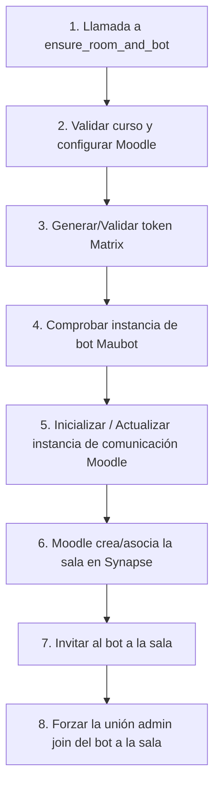

Crear archivo en: `docs/gitmetrics/classes/matrix_helper.md`

# Clase `matrix_helper`

Ubicación: `classes/matrix_helper.php`

--8<-- "gitmetrics/classes/matrix_helper.php:class_desc"

## Diagrama de Flujo Principal



### Detalle de los Pasos del Flujo

1. **[PASO 1] Llamada inicial:** Se invoca el método para asegurar la sala de un curso concreto.
2. **[PASO 2] Validar curso:** Se verifica que el curso exista y se activan los subsistemas de comunicación de Moodle si están deshabilitados.
3. **[PASO 3] Configurar Matrix:** Se loguea mediante API REST como administrador en Synapse y se almacena el token en la configuración global de Moodle.
4. **[PASO 4] Comprobar Maubot:** Se llama internamente a `ensure_maubot_active` para verificar si el contenedor del bot Matrix está levantado y la instancia del bot Git (dev.julia.githubbot) se está ejecutando. Si no lo está, la levanta mediante API PUT.
5. **[PASO 5] Inicializar comunicación:** Se gestiona la tabla `communication` de Moodle para el curso actual, creando o actualizando el registro de sala.
6. **[PASO 6] Sala Synapse:** Moodle utiliza su propio core (`core_communication`) para crear efectivamente la sala en el servidor Synapse.
7. **[PASO 7] Invitar al bot:** Se realiza una petición cURL a Synapse invitando explícitamente al `@githubbot` a la sala recién creada.
8. **[PASO 8] Unir al bot:** Se realiza una llamada adicional de administración (`admin/join`) a Synapse para forzar la aceptación de la invitación por parte del bot, quedando listo para leer eventos Git.

## Funciones Principales

### `ensure_room_and_bot`
El orquestador principal. Valida que el curso tenga una sala de Matrix asociada mediante el subsistema de comunicación de Moodle y realiza las peticiones REST a Synapse para forzar la invitación y entrada del bot.

```php
--8<-- "gitmetrics/classes/matrix_helper.php:ensure_room_and_bot"
```

### `ensure_maubot_active`
Se conecta a la API de administración de Maubot para garantizar que el cliente y la instancia de nuestro bot estén activos y logueados.

```php
--8<-- "gitmetrics/classes/matrix_helper.php:ensure_maubot_active"
```

### `process_all_existing_courses`
Función de utilidad (ideal para la CLI) que itera por todos los cursos de Moodle y ejecuta `ensure_room_and_bot` en cada uno.

```php
--8<-- "gitmetrics/classes/matrix_helper.php:process_all_existing_courses"
```
