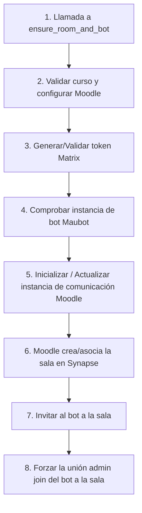

Crear archivo en: `docs/gitmetrics/classes/matrix_helper.md`

# Clase `matrix_helper`

Ubicación: `classes/matrix_helper.php`

```php
--8<-- "gitmetrics/classes/matrix_helper.php:class_desc"
```

## Diagrama de Flujo Principal


```mermaid
graph TD
    A["1. Llamada a ensure_room_and_bot"] --> B["2. Validar curso y configurar Moodle"]
    B --> C["3. Generar/Validar token Matrix"]
    C --> D["4. Comprobar instancia de bot Maubot"]
    D --> E["5. Inicializar / Actualizar instancia de comunicación Moodle"]
    E --> F["6. Moodle crea/asocia la sala en Synapse"]
    F --> G["7. Invitar al bot a la sala"]
    G --> H["8. Forzar la unión admin join del bot a la sala"]
```

### Detalle de los Pasos del Flujo

1. **[PASO 1] Llamada inicial:** Se invoca el método para asegurar la sala de un curso concreto.
2. **[PASO 2] Validar curso:** Se verifica que el curso exista y se activan los subsistemas de comunicación de Moodle si están deshabilitados.
3. **[PASO 3] Configurar Matrix:** Se loguea mediante API REST como administrador en Synapse y se almacena el token en la configuración global de Moodle.
4. **[PASO 4] Comprobar Maubot:** Se llama internamente a `ensure_maubot_active` para verificar si el contenedor del bot Matrix está levantado y la instancia del bot Git (dev.julia.llmwikiassistant) se está ejecutando. Si no lo está, la levanta mediante API PUT.
5. **[PASO 5] Inicializar comunicación:** Se gestiona la tabla `communication` de Moodle para el curso actual, creando o actualizando el registro de sala.
6. **[PASO 6] Sala Synapse:** Moodle utiliza su propio core (`core_communication`) para crear efectivamente la sala en el servidor Synapse.
7. **[PASO 7] Invitar al bot:** Se realiza una petición cURL a Synapse invitando explícitamente al `@llmwikiassistant` a la sala recién creada.
8. **[PASO 8] Unir al bot:** Se realiza una llamada adicional de administración (`admin/join`) a Synapse para forzar la aceptación de la invitación por parte del bot, quedando listo para leer eventos Git.

## Funciones Principales

### `ensure_room_and_bot`
El coordinador principal. Valida que el curso tenga una sala de Matrix asociada mediante el subsistema de comunicación de Moodle y realiza las peticiones REST a Synapse para forzar la invitación y entrada del bot.

```php
--8<-- "gitmetrics/classes/matrix_helper.php:ensure_room_and_bot"
```


### `ensure_maubot_active`
Se conecta a la API de administración de Maubot para garantizar que el cliente y la instancia de nuestro bot estén activos y logueados.

```php
--8<-- "gitmetrics/classes/matrix_helper.php:ensure_maubot_active"
```


### `process_all_existing_courses`
Función de utilidad (ideal para la CLI) que itera por todos los cursos de Moodle y ejecuta `ensure_room_and_bot` en cada uno.

```php
--8<-- "gitmetrics/classes/matrix_helper.php:process_all_existing_courses"
```

## Decisión de arquitectura: Mapeo sala Matrix ↔ curso_id

Para que el panel de métricas de Moodle pueda filtrar la actividad de los alumnos por curso, es necesario que la base de datos del bot (PostgreSQL) persista el `curso_id` asociado a cada estudiante (`estudiantes.curso_id`). Sin embargo, el bot de Matrix no conoce nativamente a qué curso pertenece una sala.

Se descartaron las siguientes opciones:
1. **Moodle escribiendo directamente en la BD del bot:** Descartado por violar el desacoplamiento. El plugin de Moodle no debe tener credenciales ni conexión directa a la base de datos interna de Maubot.
2. **Parseo del nombre o topic de la sala (`Chat del curso X`):** Descartado por ser frágil. Si un profesor renombra la sala, el enlace se rompe.

**Solución adoptada (State Event de Matrix):**
Se utiliza la infraestructura nativa de Matrix. Cuando Moodle crea o asegura la existencia de una sala (`ensure_room_and_bot`), inyecta un evento de estado (state event) personalizado llamado `es.ugr.gitmetrics.course_link` con el contenido `{"course_id": <id>}`. 
Por el otro lado, el bot (en `bot.py`), al procesar cualquier mensaje, lee de forma silenciosa este state event para la sala en la que se encuentra, cachea la resolución `room_id → course_id` en memoria para no saturar la API de Synapse, y propaga el `curso_id` al método `ensure_estudiante` de su base de datos.
Esta solución mantiene el desacoplamiento puro (Moodle y Maubot solo se comunican a través del protocolo estándar de Matrix) y garantiza una trazabilidad robusta independiente del nombre visible de la sala.
