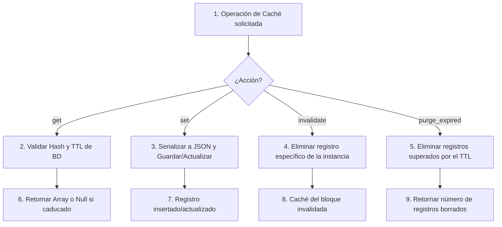

Crear archivo en: `docs/gitmetrics/classes/metrics_cache.md`

# Clase `metrics_cache`

Ubicación: `classes/metrics_cache.php`

--8<-- "gitmetrics/classes/metrics_cache.php:class_desc"

## Diagrama de Flujo Principal



### Detalle de los Pasos del Flujo

1. **[PASO 1] Operación de Caché:** Moodle (por ejemplo a través de un bloque) solicita operaciones sobre los resultados previamente cacheados para optimizar la carga.
2. **[PASO 2] Validar Hash y TTL:** En un `get`, se busca por un hash MD5 derivado de la URL del repositorio y se comprueba si el `timemodified` es más antiguo que el TTL configurado.
3. **[PASO 3] Serializar JSON:** En un `set`, se codifica el array nativo de PHP con las métricas a un string JSON seguro (`JSON_UNESCAPED_UNICODE`) antes de almacenarlo en la base de datos de Moodle.
4. **[PASO 4] Eliminar registro específico:** Una orden manual de recargar los datos dispara un `invalidate`, borrando el registro de caché ligado exclusivamente a ese bloque concreto de Moodle.
5. **[PASO 5] Eliminar registros superados:** Un `purge_expired` busca y borra todos los registros cuya última actualización (`timemodified`) es más antigua que el límite del TTL global.
6. **[PASO 6] Retornar Array:** Si la lectura es exitosa y no ha caducado, se decodifica y devuelve; si no, retorna `null` para forzar un nuevo cálculo.
7. **[PASO 7] Insertar/Actualizar:** Se utiliza la capa de abstracción de Moodle (`$DB`) para realizar inserts seguros o updates si ya existe una entrada.
8. **[PASO 8] Invalidar caché:** Efecto secundario del paso 4.
9. **[PASO 9] Retornar número borrados:** Efecto del paso 5 (ideal para ejecutarlo de forma automática en un `cron` de limpieza en Moodle).

## Funciones Principales

### `get`
Recupera y decodifica métricas almacenadas siempre y cuando su tiempo de vida (TTL) no haya caducado. Si hubo un error en la cadena JSON, borra la caché corrupta.

```php
--8<-- "gitmetrics/classes/metrics_cache.php:get"
```

### `set`
Guarda el array masivo de resultados en base de datos. Detecta automáticamente si se debe insertar un registro nuevo o actualizar uno existente (basándose en la instancia del bloque y la URL).

```php
--8<-- "gitmetrics/classes/metrics_cache.php:set"
```

### `invalidate`
Borra todos los registros en caché asociados a un identificador concreto de instancia de bloque Moodle. Usado como botón del pánico o recarga manual ("Forzar refresco").

```php
--8<-- "gitmetrics/classes/metrics_cache.php:invalidate"
```

### `purge_expired`
Función de limpieza profunda que rastrea en toda la tabla y elimina permanentemente las entradas que han superado el umbral de su TTL.

```php
--8<-- "gitmetrics/classes/metrics_cache.php:purge_expired"
```
