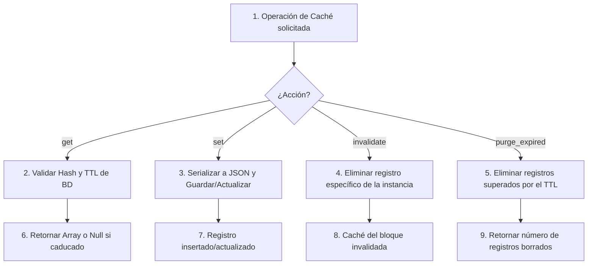

Crear archivo en: `docs/gitmetrics/classes/metrics_cache.md`

# Clase `metrics_cache`

Ubicación: `classes/metrics_cache.php`

```python
Gestión de la caché de métricas en la base de datos de Moodle.

Almacena los resultados del análisis en la tabla block_gitmetrics_cache
indexados por (blockinstanceid + MD5 de la URL del repositorio).

El TTL (time-to-live) se lee de la configuración global del plugin.
```

## Diagrama de Flujo Principal


```mermaid
graph TD
    A["1. Operación de Caché solicitada"] --> B{"¿Acción?"}
    B -->|"get"| C["2. Validar Hash y TTL de BD"]
    B -->|"set"| D["3. Serializar a JSON y Guardar/Actualizar"]
    B -->|"invalidate"| E["4. Eliminar registro específico de la instancia"]
    B -->|"purge_expired"| F["5. Eliminar registros superados por el TTL"]
    C --> G["6. Retornar Array o Null si caducado"]
    D --> H["7. Registro insertado/actualizado"]
    E --> I["8. Caché del bloque invalidada"]
    F --> J["9. Retornar número de registros borrados"]
```

### Detalle de los Pasos del Flujo

1. **[PASO 1] Operación de Caché:** Moodle (por ejemplo a través de un bloque) solicita operaciones sobre los resultados previamente cacheados para optimizar la carga.
2. **[PASO 2] Validar Hash y TTL:** En un `get`, se busca por un hash MD5 derivado de la URL del repositorio y se comprueba si el `timemodified` es más antiguo que el TTL configurado.
3. **[PASO 3] Serializar JSON:** En un `set`, se codifica el array nativo de PHP con las métricas a un string JSON seguro (`JSON_UNESCAPED_UNICODE`) antes de almacenarlo en la base de datos de Moodle.
4. **[PASO 4] Eliminar registro específico:** Una orden manual de recargar los datos dispara un `invalidate`, borrando el registro de caché ligado exclusivamente a ese bloque concreto de Moodle.
5. **[PASO 5] Eliminar registros superados:** Un `purge_expired` busca y borra todos los registros cuya última actualización (`timemodified`) es más antigua que el límite del TTL global.
6. **[PASO 6] Retornar Array:** Si la lectura es exitosa y no ha caducado, se decodifica y devuelve; si no, retorna `null` para forzar un nuevo cálculo.
7. **[PASO 7] Insertar/Actualizar:** Se utiliza la capa de abstracción de Moodle (`$DB`) para realizar inserts seguros o updates si ya existe una entrada.
8. **[PASO 8] Invalidar caché:** Efecto secundario del paso 4.
9. **[PASO 9] Retornar número borrados:** Efecto del paso 5 (ideal para ejecutarlo de forma automática en un `cron` de limpieza en Moodle).

## Funciones Principales

### `get`
Recupera y decodifica métricas almacenadas siempre y cuando su tiempo de vida (TTL) no haya caducado. Si hubo un error en la cadena JSON, borra la caché corrupta.

```php
```python
public function get(string $repo_url, int $block_id): ?array {
    $ttl      = $this->get_ttl();
    $min_time = time() - $ttl;
    $hash     = md5($repo_url);

    $record = $this->db->get_record(self::TABLE, [
        'blockinstanceid' => $block_id,
        'repo_url_hash'   => $hash,
    ]);

    if (!$record) {
        return null; // Sin entrada en caché
    }

    if ($record->timemodified < $min_time) {
        return null; // Caché caducada
    }

    $data = json_decode($record->metrics_json, true);

    if (json_last_error() !== JSON_ERROR_NONE) {
        // JSON corrupto: eliminar el registro
        $this->db->delete_records(self::TABLE, ['id' => $record->id]);
        return null;
    }

    return $data;
}
// 
```


### `set`
Guarda el array masivo de resultados en base de datos. Detecta automáticamente si se debe insertar un registro nuevo o actualizar uno existente (basándose en la instancia del bloque y la URL).

```php
```python
public function set(string $repo_url, int $block_id, array $metrics): void {
    $hash    = md5($repo_url);
    $json    = json_encode($metrics, JSON_UNESCAPED_UNICODE | JSON_PRETTY_PRINT);
    $now     = time();

    $existing = $this->db->get_record(self::TABLE, [
        'blockinstanceid' => $block_id,
        'repo_url_hash'   => $hash,
    ]);

    if ($existing) {
        $existing->repo_url      = substr($repo_url, 0, 500); // respetar longitud BD
        $existing->metrics_json  = $json;
        $existing->timemodified  = $now;
        $this->db->update_record(self::TABLE, $existing);
    } else {
        $record                   = new \stdClass();
        $record->blockinstanceid  = $block_id;
        $record->repo_url         = substr($repo_url, 0, 500);
        $record->repo_url_hash    = $hash;
        $record->metrics_json     = $json;
        $record->timecreated      = $now;
        $record->timemodified     = $now;
        $this->db->insert_record(self::TABLE, $record);
    }
}
// 
```


### `invalidate`
Borra todos los registros en caché asociados a un identificador concreto de instancia de bloque Moodle. Usado como botón del pánico o recarga manual ("Forzar refresco").

```php
```python
public function invalidate(int $block_id): void {
    $this->db->delete_records(self::TABLE, ['blockinstanceid' => $block_id]);
}
// 
```


### `purge_expired`
Función de limpieza profunda que rastrea en toda la tabla y elimina permanentemente las entradas que han superado el umbral de su TTL.

```php
```python
public function purge_expired(): int {
    $min_time = time() - $this->get_ttl();
    return $this->db->delete_records_select(
        self::TABLE,
        'timemodified < :mintime',
        ['mintime' => $min_time]
    );
}
// 
```

