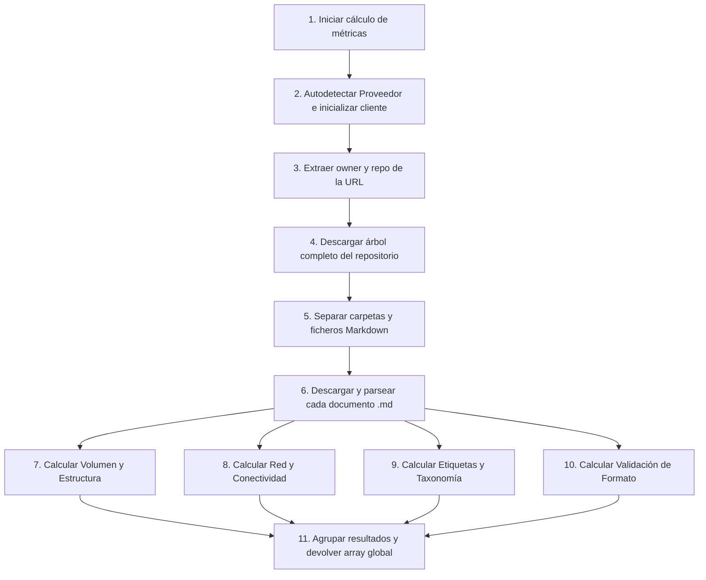

# Clase `metrics_calculator`

Ubicación: `classes/metrics_calculator.php`

--8<-- "gitmetrics/classes/metrics_calculator.php:class_desc"

## Diagrama de Flujo Principal



### Detalle de los Pasos del Flujo

1. **[PASO 1] Iniciar cálculo de métricas:** Se invoca el método principal recibiendo la URL pública del repositorio y la rama a analizar.
2. **[PASO 2] Autodetectar Proveedor:** Se evalúa la URL para determinar si pertenece a GitHub o GitLab (pudiendo detectar dominios de GitLab self-hosted) y se instancia el cliente HTTP correspondiente.
3. **[PASO 3] Extraer owner y repo:** Se limpia y analiza la URL mediante expresiones regulares para obtener el usuario/organización y el nombre del proyecto.
4. **[PASO 4] Descargar árbol completo:** Se lanza una petición al API de Git para obtener el árbol completo (recursivo) de la rama seleccionada. En caso de error, se intenta un _fallback_ automático de `main` a `master` (o viceversa).
5. **[PASO 5] Separar carpetas y ficheros Markdown:** Se filtran los nodos descargados para agrupar por un lado todos los directorios y por otro exclusivamente los ficheros con extensión `.md`.
6. **[PASO 6] Descargar y parsear cada documento:** Se recorre la lista de archivos `.md` solicitando el texto en bruto y pasándolo por el `markdown_parser` para extraer sus metadatos (palabras, enlaces, frontmatter, etc.).
7. **[PASO 7] Calcular Volumen y Estructura:** Se agregan estadísticas de tamaño en bytes, conteo total de palabras, profundidad media del árbol y se verifica la existencia de archivos esenciales OKF (`AGENTS.md`, `INDEX.md`, `LOG.md`).
8. **[PASO 8] Calcular Red y Conectividad:** Se cruzan los enlaces internos de cada fichero contra los ficheros existentes para calcular la densidad de enlazado y detectar nodos huérfanos.
9. **[PASO 9] Calcular Etiquetas y Taxonomía:** Se recopila una lista global de *tags* del frontmatter, se genera el top 10 y se calcula la distancia de Hamming para evaluar la diversidad temática.
10. **[PASO 10] Calcular Validación de Formato:** Se contabiliza cuántos ficheros tienen errores estructurales de Markdown o frontmatter YAML mal formado.
11. **[PASO 11] Agrupar resultados:** Todas las subcategorías se combinan en un único diccionario de datos masivo que se devuelve al bloque de Moodle para su renderizado.

## Funciones Principales

### `__construct`
Inicializa la calculadora, configurando el token y seleccionando la fábrica del proveedor Git correspondiente.

```php
--8<-- "gitmetrics/classes/metrics_calculator.php:construct"
```

### `make_client`
Método estático de fábrica que decide, basándose en el parámetro del proveedor o en la estructura de la URL del repositorio, si instanciar un cliente para la API de GitHub o para la de GitLab.

```php
--8<-- "gitmetrics/classes/metrics_calculator.php:make_client"
```

### `calculate`
Punto de entrada principal. Coordina la descarga del árbol, lanza el proceso de parsing y agrupa los cálculos de cada una de las 4 subcategorías de métricas en un gran array consolidado.

```php
--8<-- "gitmetrics/classes/metrics_calculator.php:calculate"
```

### `fetch_and_parse`
Recibe la lista filtrada de *blobs* Markdown, y para cada uno descarga el código raw desde la API e invoca el *parser* para extraer la información.

```php
--8<-- "gitmetrics/classes/metrics_calculator.php:fetch_and_parse"
```

### `calc_volume`
Analiza los datos agregados para proporcionar estadísticas base como el recuento total, tamaños, recuento de palabras, profundidad y distribución en directorios.

```php
--8<-- "gitmetrics/classes/metrics_calculator.php:calc_volume"
```

### `calc_network`
Identifica las relaciones (links entrantes y salientes) entre documentos. Normaliza los enlaces para cruzar correspondencias y localiza ficheros "huérfanos" (aislados del resto).

```php
--8<-- "gitmetrics/classes/metrics_calculator.php:calc_network"
```

### `calc_tags`
Extrae y normaliza el campo `tags` del YAML frontmatter de cada archivo. Calcula las frecuencias globales y usa la Distancia media de Hamming para medir la diversidad.

```php
--8<-- "gitmetrics/classes/metrics_calculator.php:calc_tags"
```

### `calc_format`
Agrupa y cuantifica la validez formal de los documentos en base a las banderas establecidas previamente por el `markdown_parser` (porcentajes de éxito y listas de errores).

```php
--8<-- "gitmetrics/classes/metrics_calculator.php:calc_format"
```

### `parse_repo_url`
Utilidad que limpia la URL introducida por el profesor y extrae el *owner* (propietario o grupo) y el *repo* mediante patrones Regex robustos.

```php
--8<-- "gitmetrics/classes/metrics_calculator.php:parse_repo_url"
```
