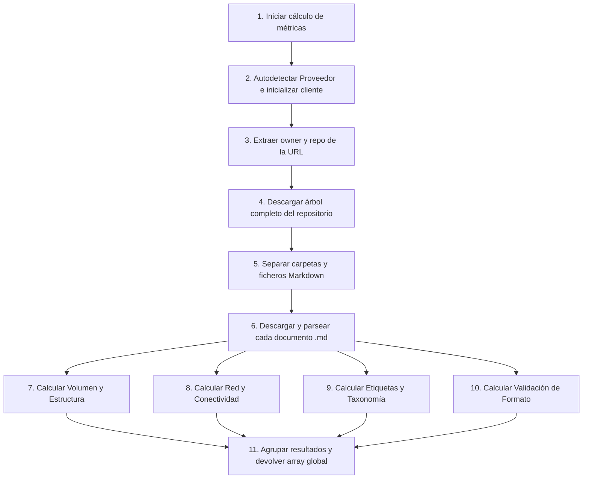

# Clase `metrics_calculator`

Ubicación: `classes/metrics_calculator.php`

```python
Calculadora de métricas de la Base de Conocimiento.

Orquesta la descarga del árbol del repositorio GitHub, el parseo
de cada archivo Markdown y el cálculo de las cuatro categorías
de métricas: Volumen, Red, Etiquetas y Formato.
```

## Diagrama de Flujo Principal


```mermaid
graph TD
    A["1. Iniciar cálculo de métricas"] --> B["2. Autodetectar Proveedor e inicializar cliente"]
    B --> C["3. Extraer owner y repo de la URL"]
    C --> D["4. Descargar árbol completo del repositorio"]
    D --> E["5. Separar carpetas y ficheros Markdown"]
    E --> F["6. Descargar y parsear cada documento .md"]
    F --> G["7. Calcular Volumen y Estructura"]
    F --> H["8. Calcular Red y Conectividad"]
    F --> I["9. Calcular Etiquetas y Taxonomía"]
    F --> J["10. Calcular Validación de Formato"]
    G --> K["11. Agrupar resultados y devolver array global"]
    H --> K
    I --> K
    J --> K
```

### Detalle de los Pasos del Flujo

1. **[PASO 1] Iniciar cálculo de métricas:** Se invoca el método principal recibiendo la URL pública del repositorio y la rama a analizar.
2. **[PASO 2] Autodetectar Proveedor:** Se evalúa la URL para determinar si pertenece a GitHub o GitLab (pudiendo detectar dominios de GitLab self-hosted) y se instancia el cliente HTTP correspondiente.
3. **[PASO 3] Extraer owner y repo:** Se limpia y analiza la URL mediante expresiones regulares para obtener el usuario/organización y el nombre del proyecto.
4. **[PASO 4] Descargar árbol completo:** Se lanza una petición al API de Git para obtener el árbol completo (recursivo) de la rama seleccionada. En caso de error, se intenta un _fallback_ automático de `main` a `master` (o viceversa).
5. **[PASO 5] Separar carpetas y ficheros Markdown:** Se filtran los nodos descargados para agrupar por un lado todos los directorios y por otro exclusivamente los ficheros con extensión `.md`.
6. **[PASO 6] Descargar y parsear cada documento:** Se recorre la lista de archivos `.md` solicitando el texto en bruto y pasándolo por el `markdown_parser` para extraer sus metadatos (palabras, enlaces, frontmatter, etc.).
7. **[PASO 7] Calcular Volumen y Estructura:** Se agregan estadísticas de tamaño en bytes, conteo total de palabras, profundidad media del árbol y se verifica la existencia de archivos esenciales OKF (`AGENTS.md`, `INDEX.md`, `LOG.md`).
8. **[PASO 8] Calcular Red y Conectividad:** Se cruzan los enlaces internos de cada fichero contra los ficheros existentes para calcular la densidad de enlazado y detectar nodos huérfanos.
9. **[PASO 9] Calcular Etiquetas y Taxonomía:** Se recopila una lista global de *tags* del frontmatter, se genera el top 10 y se calcula la distancia de Hamming para evaluar la diversidad temática.
10. **[PASO 10] Calcular Validación de Formato:** Se contabiliza cuántos ficheros tienen errores estructurales de Markdown o frontmatter YAML mal formado.
11. **[PASO 11] Agrupar resultados:** Todas las subcategorías se combinan en un único diccionario de datos masivo que se devuelve al bloque de Moodle para su renderizado.

## Funciones Principales

### `__construct`
Inicializa la calculadora, configurando el token y seleccionando la fábrica del proveedor Git correspondiente.

```php
```python
public function __construct(string $token = '', string $provider = 'auto', string $gitlab_url = 'https://gitlab.com') {
    $this->token      = $token;
    $this->provider   = $provider;
    $this->gitlab_url = $gitlab_url;
    $this->client     = self::make_client($provider, $token, $gitlab_url);
    $this->parser     = new markdown_parser();
}
// 
```


### `make_client`
Método estático de fábrica que decide, basándose en el parámetro del proveedor o en la estructura de la URL del repositorio, si instanciar un cliente para la API de GitHub o para la de GitLab.

```php
```python
public static function make_client(
    string $provider,
    string $token,
    string $gitlab_url = 'https://gitlab.com',
    string $repo_url = ''
): git_provider_interface {
    // Auto-deteccion por URL si el proveedor es 'auto'
    if ($provider === 'auto' && !empty($repo_url)) {
        if (strpos($repo_url, 'github.com') !== false) {
            $provider = 'github';
        } else {
            $provider = 'gitlab';
            // Extraer la URL base del servidor desde la URL del repo
            $parts = parse_url($repo_url);
            if (!empty($parts['host'])) {
                $gitlab_url = ($parts['scheme'] ?? 'https') . '://' . $parts['host'];
                if (!empty($parts['port'])) {
                    $gitlab_url .= ':' . $parts['port'];
                }
            }
        }
    }

    if ($provider === 'gitlab') {
        return new gitlab_client($gitlab_url, $token);
    }
    return new github_client($token);
}
// 
```


### `calculate`
Punto de entrada principal. Coordina la descarga del árbol, lanza el proceso de parsing y agrupa los cálculos de cada una de las 4 subcategorías de métricas en un gran array consolidado.

```php
```python
public function calculate(string $repo_url, string $branch = 'main'): array {
    // Asegurar detección del proveedor según la URL al ejecutar el cálculo
    if ($this->provider === 'auto' || str_contains($repo_url, 'gitlab') || str_contains($repo_url, 'github.com')) {
        $this->client = self::make_client('auto', $this->token, $this->gitlab_url, $repo_url);
    }

    [$owner, $repo] = $this->parse_repo_url($repo_url);

    // Intentar con la rama solicitada; si no existe, probar la alternativa
    $actual_branch = $branch;
    try {
        $tree = $this->client->get_tree($owner, $repo, $branch);
    } catch (\Exception $e) {
        $fallback = ($branch === 'main') ? 'master' : 'main';
        try {
            $tree          = $this->client->get_tree($owner, $repo, $fallback);
            $actual_branch = $fallback;
        } catch (\Exception $e2) {
            throw new \Exception(
                get_string('error_repo', 'block_gitmetrics') . ': ' . $e->getMessage()
            );
        }
    }

    // Separar ficheros y directorios
    $all_blobs  = array_values(array_filter($tree, fn($n) => $n['type'] === 'blob'));
    $all_trees  = array_values(array_filter($tree, fn($n) => $n['type'] === 'tree'));
    $md_blobs   = array_values(array_filter(
        $all_blobs,
        fn($n) => strtolower(pathinfo($n['path'], PATHINFO_EXTENSION)) === 'md'
    ));

    // Descargar y parsear cada archivo .md
    $files_data = $this->fetch_and_parse($owner, $repo, $actual_branch, $md_blobs);

    return [
        'repo_url'     => $repo_url,
        'owner'        => $owner,
        'repo'         => $repo,
        'branch'       => $actual_branch,
        'timestamp'    => time(),
        'volume'       => $this->calc_volume($files_data, $all_blobs, $all_trees, $tree),
        'network'      => $this->calc_network($files_data),
        'tags'         => $this->calc_tags($files_data),
        'format'       => $this->calc_format($files_data),
    ];
}
// 
```


### `fetch_and_parse`
Recibe la lista filtrada de *blobs* Markdown, y para cada uno descarga el código raw desde la API e invoca el *parser* para extraer la información.

```php
```python
private function fetch_and_parse(
    string $owner,
    string $repo,
    string $branch,
    array  $md_blobs
): array {
    $files_data = [];
    foreach ($md_blobs as $blob) {
        $content    = $this->client->get_file_content($owner, $repo, $blob['path'], $branch);
        $parsed     = $this->parser->parse($content, $blob['path']);
        // El tamaño lo tomamos del API (más fiable que strlen en UTF-8)
        $parsed['size_bytes'] = $blob['size'] ?? strlen($content);
        $files_data[] = $parsed;
    }
    return $files_data;
}
// 
```


### `calc_volume`
Analiza los datos agregados para proporcionar estadísticas base como el recuento total, tamaños, recuento de palabras, profundidad y distribución en directorios.

```php
```python
private function calc_volume(
    array $files_data,
    array $all_blobs,
    array $all_trees,
    array $full_tree
): array {
    $md_count    = count($files_data);
    $total_blobs = count($all_blobs);

    $sizes       = array_column($files_data, 'size_bytes');
    $word_counts = array_column($files_data, 'word_count');

    // Profundidad: número de '/' en la ruta de cada nodo
    $all_paths = array_column($full_tree, 'path');
    $depths    = array_map(fn($p) => substr_count($p, '/'), $all_paths);

    // Archivos esenciales OKF (búsqueda case-insensitive en todo el árbol)
    $all_paths_lower = array_map('strtolower', $all_paths);
    $essential_keys  = ['AGENTS.md', 'LOG.md', 'INDEX.md'];
    $essential       = [];
    foreach ($essential_keys as $ek) {
        $ek_lower = strtolower($ek);
        // Buscar en cualquier nivel del árbol
        $found = array_filter($all_paths_lower, fn($p) => $p === $ek_lower || str_ends_with($p, '/' . $ek_lower));
        $essential[$ek] = !empty($found)
            ? ['present' => true, 'path' => array_values($found)[0]]
            : ['present' => false, 'path' => null];
    }

    // Distribución de archivos .md por directorio
    $files_by_dir = [];
    foreach ($files_data as $f) {
        $dir = dirname($f['path']);
        $dir = ($dir === '.') ? '/' : $dir;
        if (!isset($files_by_dir[$dir])) $files_by_dir[$dir] = 0;
        $files_by_dir[$dir]++;
    }
    arsort($files_by_dir);

    // Detalle por archivo
    $files_detail = array_map(fn($f) => [
        'path'       => $f['path'],
        'size_bytes' => $f['size_bytes'],
        'word_count' => $f['word_count'],
    ], $files_data);

    return [
        'md_file_count'    => $md_count,
        'total_file_count' => $total_blobs,
        'dir_count'        => count($all_trees),
        'total_size_bytes' => array_sum($sizes),
        'avg_size_bytes'   => $md_count > 0 ? round(array_sum($sizes) / $md_count, 2) : 0,
        'total_words'      => array_sum($word_counts),
        'avg_word_count'   => $md_count > 0 ? round(array_sum($word_counts) / $md_count, 2) : 0,
        'max_word_count'   => !empty($word_counts) ? max($word_counts) : 0,
        'min_word_count'   => !empty($word_counts) ? min($word_counts) : 0,
        'max_depth'        => !empty($depths) ? max($depths) : 0,
        'avg_depth'        => !empty($depths) ? round(array_sum($depths) / count($depths), 2) : 0,
        'essential_files'  => $essential,
        'files_by_dir'     => $files_by_dir,
        'files_detail'     => $files_detail,
    ];
}
// 
```


### `calc_network`
Identifica las relaciones (links entrantes y salientes) entre documentos. Normaliza los enlaces para cruzar correspondencias y localiza ficheros "huérfanos" (aislados del resto).

```php
```python
private function calc_network(array $files_data): array {
    $n = count($files_data);

    if ($n === 0) {
        return [
            'total_nodes'          => 0,
            'avg_connections'      => 0.0,
            'orphan_count'         => 0,
            'orphan_rate'          => 0.0,
            'total_internal_links' => 0,
            'link_density'         => 0.0,
            'connectivity_detail'  => [],
        ];
    }

    $file_paths = array_column($files_data, 'path');
    $total_words = array_sum(array_column($files_data, 'word_count'));

    // outgoing[i] = número de enlaces VÁLIDOS que salen del nodo i
    $outgoing    = array_fill(0, $n, 0);
    // has_incoming[i] = true si algún otro nodo enlaza al nodo i
    $has_incoming = array_fill(0, $n, false);
    $total_links  = 0;

    foreach ($files_data as $i => $file) {
        foreach ($file['internal_links'] as $link_raw) {
            // Normalizar: quitar anclas (#) y parámetros (?)
            $link = strtolower(preg_replace('/[?#].*$/', '', $link_raw));
            $link = trim($link, './');

            // Intentar resolver contra cada nodo conocido
            foreach ($file_paths as $j => $known_path) {
                if ($j === $i) continue;
                $known_lower = strtolower($known_path);
                $known_base  = strtolower(basename($known_path));

                if (
                    $link === $known_lower ||
                    $link === $known_base  ||
                    str_ends_with($known_lower, '/' . $link)
                ) {
                    $outgoing[$i]++;
                    $has_incoming[$j] = true;
                    $total_links++;
                    break;
                }
            }
        }
    }

    // Nodos huérfanos: sin enlaces salientes Y sin enlaces entrantes
    $orphan_indices = [];
    for ($i = 0; $i < $n; $i++) {
        if ($outgoing[$i] === 0 && !$has_incoming[$i]) {
            $orphan_indices[] = $i;
        }
    }

    $orphan_count    = count($orphan_indices);
    $avg_connections = round(array_sum($outgoing) / $n, 4);
    $orphan_rate     = round(($orphan_count / $n) * 100, 2);
    $link_density    = $total_words > 0 ? round($total_links / $total_words, 6) : 0.0;

    // Detalle por nodo
    $detail = [];
    for ($i = 0; $i < $n; $i++) {
        $detail[] = [
            'path'         => $files_data[$i]['path'],
            'outgoing'     => $outgoing[$i],
            'has_incoming' => $has_incoming[$i],
            'is_orphan'    => in_array($i, $orphan_indices),
        ];
    }

    return [
        'total_nodes'          => $n,
        'avg_connections'      => $avg_connections,
        'orphan_count'         => $orphan_count,
        'orphan_rate'          => $orphan_rate,
        'total_internal_links' => $total_links,
        'link_density'         => $link_density,
        'connectivity_detail'  => $detail,
    ];
}
// 
```


### `calc_tags`
Extrae y normaliza el campo `tags` del YAML frontmatter de cada archivo. Calcula las frecuencias globales y usa la Distancia media de Hamming para medir la diversidad.

```php
```python
private function calc_tags(array $files_data): array {
    $tag_frequency = [];  // tag => número de archivos que lo usan
    $tag_sets      = [];  // [ [tags del archivo 0], [tags del archivo 1], ... ]

    foreach ($files_data as $file) {
        $tags = array_map('strtolower', array_map('trim', $file['tags'] ?? []));
        $tags = array_values(array_filter($tags));
        $tag_sets[] = $tags;

        foreach ($tags as $tag) {
            if (!isset($tag_frequency[$tag])) $tag_frequency[$tag] = 0;
            $tag_frequency[$tag]++;
        }
    }

    $unique_tags        = array_keys($tag_frequency);
    $total_unique       = count($unique_tags);
    $total_usage        = array_sum($tag_frequency);
    $files_with_tags    = count(array_filter($tag_sets, fn($ts) => !empty($ts)));
    $files_without_tags = count($files_data) - $files_with_tags;

    // Distancia de Hamming media entre pares de documentos
    $hamming_avg = $this->hamming_avg_distance($tag_sets, $unique_tags);

    // Top 10 etiquetas más usadas
    arsort($tag_frequency);
    $top_tags = array_slice($tag_frequency, 0, 10, true);

    return [
        'total_unique_tags'  => $total_unique,
        'total_tag_usage'    => $total_usage,
        'files_with_tags'    => $files_with_tags,
        'files_without_tags' => $files_without_tags,
        'hamming_avg'        => round($hamming_avg, 4),
        'top_tags'           => $top_tags,
        'all_tags'           => $tag_frequency,
    ];
}
// 
```


### `calc_format`
Agrupa y cuantifica la validez formal de los documentos en base a las banderas establecidas previamente por el `markdown_parser` (porcentajes de éxito y listas de errores).

```php
```python
private function calc_format(array $files_data): array {
    $total = count($files_data);

    if ($total === 0) {
        return [
            'files_with_frontmatter'  => 0,
            'frontmatter_rate'        => 0.0,
            'valid_frontmatter_count' => 0,
            'valid_frontmatter_rate'  => 0.0,
            'valid_markdown_count'    => 0,
            'valid_markdown_rate'     => 0.0,
            'frontmatter_errors'      => [],
            'markdown_errors'         => [],
        ];
    }

    $with_fm    = array_filter($files_data, fn($f) => $f['has_frontmatter']);
    $valid_fm   = array_filter($files_data, fn($f) => $f['is_valid_frontmatter']);
    $valid_md   = array_filter($files_data, fn($f) => $f['is_valid_markdown']);

    // Recopilar errores por archivo
    $fm_errors = [];
    $md_errors = [];
    foreach ($files_data as $f) {
        if (!empty($f['frontmatter_errors'])) {
            $fm_errors[$f['path']] = $f['frontmatter_errors'];
        }
        if (!empty($f['markdown_errors'])) {
            $md_errors[$f['path']] = $f['markdown_errors'];
        }
    }

    return [
        'files_with_frontmatter'  => count($with_fm),
        'frontmatter_rate'        => round((count($with_fm) / $total) * 100, 2),
        'valid_frontmatter_count' => count($valid_fm),
        'valid_frontmatter_rate'  => round((count($valid_fm) / $total) * 100, 2),
        'valid_markdown_count'    => count($valid_md),
        'valid_markdown_rate'     => round((count($valid_md) / $total) * 100, 2),
        'frontmatter_errors'      => $fm_errors,
        'markdown_errors'         => $md_errors,
    ];
}
// 
```


### `parse_repo_url`
Utilidad que limpia la URL introducida por el profesor y extrae el *owner* (propietario o grupo) y el *repo* mediante patrones Regex robustos.

```php
```python
private function parse_repo_url(string $url): array {
    $url = rtrim(trim($url), '/');
    $url = preg_replace('/\.git$/i', '', $url);

    // GitHub: host fijo
    if (preg_match('#^https?://github\.com/([^/]+)/([^/]+)$#i', $url, $m)) {
        return [$m[1], $m[2]];
    }

    // GitLab: cualquier host, owner puede tener namespaces (grupo/subgrupo)
    // Capturamos todo lo anterior al ultimo segmento como owner y el ultimo como repo
    if (preg_match('#^https?://[^/]+/(.+)/([^/]+)$#i', $url, $m)) {
        return [$m[1], $m[2]];
    }

    throw new \Exception(get_string('error_invalid_url', 'block_gitmetrics'));
}
// 
```

