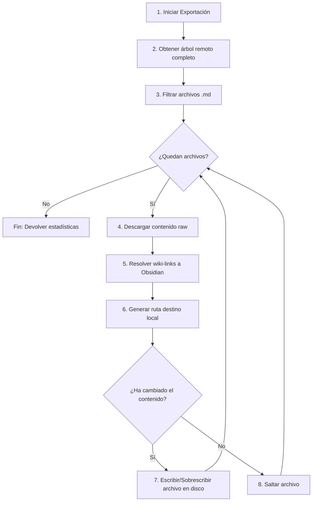

# Clase `obsidian_exporter`

Ubicación: `classes/obsidian_exporter.php`

--8<-- "gitmetrics/classes/obsidian_exporter.php:class_desc"

## Diagrama de Flujo Principal



### Detalle de los Pasos del Flujo

1. **[PASO 1] Iniciar Exportación:** Se invoca el método `export()` con los datos del repositorio y el cliente de Git ya inicializado.
2. **[PASO 2] Obtener árbol remoto completo:** A través del API de GitHub/GitLab, se solicita la lista recursiva de todos los archivos del repositorio en la rama indicada.
3. **[PASO 3] Filtrar archivos .md:** Se descartan todos los ficheros que no sean blobs con extensión `.md`.
4. **[PASO 4] Descargar contenido raw:** Para cada fichero Markdown encolado, se descarga su contenido de texto desde el repositorio a la memoria temporal (sin pasar por la BD de Moodle).
5. **[PASO 5] Resolver wiki-links a Obsidian:** Se analiza el texto usando expresiones regulares para convertir enlaces largos (ej: `[[carpeta/archivo|Texto]]`) en enlaces cortos nativos de Obsidian (`[[archivo|Texto]]`).
6. **[PASO 6] Generar ruta destino local:** Se calcula en qué subcarpeta del vault local de Obsidian debe guardarse el fichero, creando los directorios intermedios si no existen.
7. **[PASO 7] Escribir/Sobrescribir archivo en disco:** Si el contenido parseado difiere de lo que ya hay en el disco duro, se sobrescribe físicamente.
8. **[PASO 8] Saltar archivo:** Si el contenido es idéntico, se evita la escritura para no alterar las fechas de modificación del vault local.

## Funciones Principales

### `__construct`
Constructor de la clase. Recibe la URL del repositorio, el cliente de Git instanciado y extrae el *owner* y el *repo* necesarios para las llamadas a la API.

```php
--8<-- "gitmetrics/classes/obsidian_exporter.php:construct"
```

### `export`
Ejecuta la exportación completa iterando sobre todos los archivos `.md`, procesándolos y guardándolos localmente. Devuelve estadísticas sobre los ficheros escritos, saltados o con errores.

```php
--8<-- "gitmetrics/classes/obsidian_exporter.php:export"
```

### `resolve_wikilinks`
Transforma los `[[wiki-links]]` del estándar de repositorio OKF al formato plano nativo de Obsidian (extrayendo únicamente el *basename* de cada archivo).

```php
--8<-- "gitmetrics/classes/obsidian_exporter.php:resolve_wikilinks"
```

### `get_obsidian_uri`
Método estático de utilidad para construir una URL de protocolo `obsidian://` que permite abrir una nota específica directamente en la aplicación de escritorio.

```php
--8<-- "gitmetrics/classes/obsidian_exporter.php:get_obsidian_uri"
```
