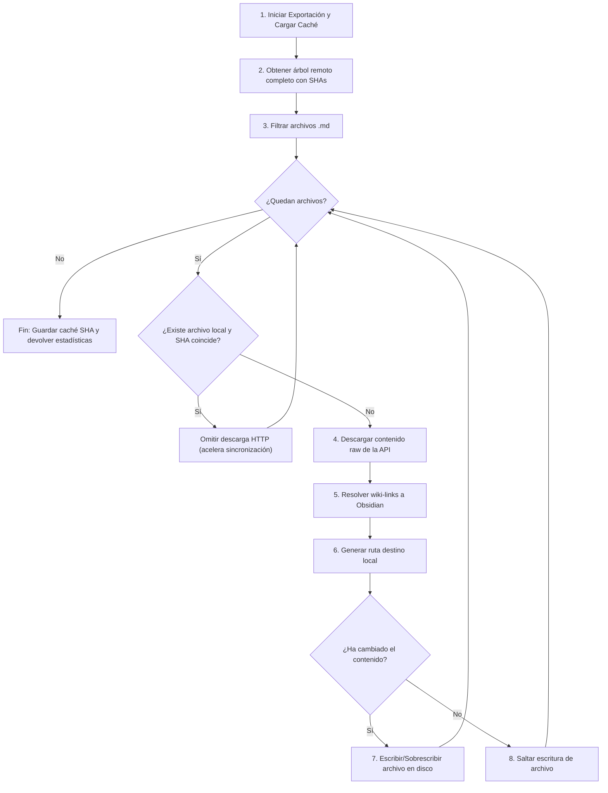

# Clase `obsidian_exporter`

Ubicación: `classes/obsidian_exporter.php`

```python
Descarga los documentos Markdown de un repositorio Git remoto y los
sincroniza con un vault local de Obsidian en el sistema de archivos,
resolviendo además los enlaces internos (`[[wiki-links]]`) para que
sean compatibles con el cliente nativo de Obsidian.

Utiliza una caché local de hashes SHA1 de Git (`.obsidian_sync_cache.json`)
para evitar peticiones HTTP innecesarias cuando los archivos remotos
no han cambiado.
```

## Diagrama de Flujo Principal


```mermaid
graph TD
    A["1. Iniciar Exportación y Cargar Caché"] --> B["2. Obtener árbol remoto completo con SHAs"]
    B --> C["3. Filtrar archivos .md"]
    C --> D{"¿Quedan archivos?"}
    D -- No --> E["Fin: Guardar caché SHA y devolver estadísticas"]
    D -- Sí --> F{"¿Existe archivo local y SHA coincide?"}
    F -- Sí --> L["Omitir descarga HTTP (acelera sincronización)"]
    F -- No --> G["4. Descargar contenido raw de la API"]
    G --> H["5. Resolver wiki-links a Obsidian"]
    H --> I["6. Generar ruta destino local"]
    I --> J{"¿Ha cambiado el contenido?"}
    J -- Sí --> K["7. Escribir/Sobrescribir archivo en disco"]
    J -- No --> M["8. Saltar escritura de archivo"]
    K --> D
    M --> D
    L --> D
```

### Detalle de los Pasos del Flujo

1. **[PASO 1] Iniciar Exportación y Cargar Caché:** Se invoca el método `export()` con los datos del repositorio y el cliente de Git ya inicializado. Se lee el archivo de caché local `.obsidian_sync_cache.json` que almacena los SHAs del último sync.
2. **[PASO 2] Obtener árbol remoto completo con SHAs:** A través de la API de GitHub/GitLab, se solicita la lista recursiva de todos los archivos del repositorio en la rama indicada, obteniendo sus rutas y hashes SHA del blob Git.
3. **[PASO 3] Filtrar archivos .md:** Se descartan todos los ficheros que no sean blobs con extensión `.md`.
4. **[PASO 4] Comprobar Caché SHA:** Si el archivo ya existe localmente y su hash SHA1 del árbol Git remoto es idéntico al guardado en la caché local, se **omite por completo la petición HTTP de descarga**, haciendo el proceso casi instantáneo.
5. **[PASO 5] Descargar contenido raw:** Para cada fichero nuevo o modificado remotamente, se descarga su contenido de texto desde el repositorio a la memoria temporal.
6. **[PASO 6] Resolver wiki-links a Obsidian:** Se analiza el texto usando expresiones regulares para convertir enlaces largos (ej: `[[carpeta/archivo|Texto]]`) en enlaces cortos nativos de Obsidian (`[[archivo|Texto]]`).
7. **[PASO 7] Generar ruta y escribir en disco:** Se calcula en qué subcarpeta del vault debe guardarse el fichero, creando carpetas si no existen. Si el contenido difiere del disco duro, se sobrescribe físicamente.
8. **[PASO 8] Guardar Caché y Saltar archivo:** Al finalizar la iteración, se guarda la nueva tabla de hashes de Git en el archivo `.obsidian_sync_cache.json` del vault.

## Funciones Principales

### `__construct`
Constructor de la clase. Recibe la URL del repositorio, el cliente de Git instanciado y extrae el *owner* y el *repo* necesarios para las llamadas a la API.

```php
```python
public function __construct(
    git_provider_interface $git_client,
    string $repourl,
    string $vault_path,
    string $branch = 'main'
) {
    $this->git_client = $git_client;
    $this->vault_path = rtrim($vault_path, '/\\');
    $this->branch     = $branch;

    // Extraer owner y repo de la URL
    $parsed     = parse_url($repourl);
    $path_parts = array_values(array_filter(explode('/', trim($parsed['path'] ?? '', '/'))));
    if (count($path_parts) < 2) {
        throw new \moodle_exception('error_invalid_url', 'block_gitmetrics');
    }
    $this->owner = $path_parts[0];
    $this->repo  = $path_parts[1];
}
// 
```


### `export`
Ejecuta la exportación completa iterando sobre todos los archivos `.md`, comprobando la caché local de hashes SHA de Git, procesándolos y guardándolos localmente. Devuelve estadísticas sobre los ficheros escritos, saltados o con errores.

```php
```python
public function export(): array {
    $stats = ['written' => 0, 'skipped' => 0, 'errors' => []];

    // Cargar caché local de SHAs de Git para evitar descargas HTTP redundantes
    $cache_file = $this->vault_path . DIRECTORY_SEPARATOR . '.obsidian_sync_cache.json';
    $sha_cache  = [];
    if (is_file($cache_file)) {
        $cached_data = json_decode(file_get_contents($cache_file), true);
        if (is_array($cached_data)) {
            $sha_cache = $cached_data;
        }
    }
    $new_cache = [];

    // Obtener árbol completo del repositorio
    $tree = $this->git_client->get_tree($this->owner, $this->repo, $this->branch);

    // Filtrar solo archivos Markdown
    $md_files = array_filter($tree, function (array $node): bool {
        return $node['type'] === 'blob'
            && str_ends_with(strtolower($node['path']), '.md');
    });

    foreach ($md_files as $node) {
        $filepath   = $node['path'];
        $remote_sha = $node['sha'] ?? '';

        // Calcular ruta destino dentro del vault, manteniendo la estructura de carpetas del repo
        $target_path = $this->vault_path . DIRECTORY_SEPARATOR
            . str_replace('/', DIRECTORY_SEPARATOR, $filepath);

        // Si el archivo ya existe localmente, tenemos un SHA remoto válido y coincide con la caché,
        // nos saltamos la llamada HTTP a get_file_content por completo.
        if (is_file($target_path) && !empty($remote_sha) && isset($sha_cache[$filepath]) && $sha_cache[$filepath] === $remote_sha) {
            $stats['skipped']++;
            $new_cache[$filepath] = $remote_sha;
            continue;
        }

        try {
            // Descargar contenido raw desde la API (en memoria, sin escribir en Moodle)
            $raw_content = $this->git_client->get_file_content(
                $this->owner, $this->repo, $filepath, $this->branch
            );

            // Transformar los [[wiki-links]] al formato nativo de Obsidian
            $obsidian_content = $this->resolve_wikilinks($raw_content);

            // Crear carpetas intermedias si no existen
            $target_dir = dirname($target_path);
            if (!is_dir($target_dir)) {
                mkdir($target_dir, 0755, true);
            }

            // Escribir solo si el contenido ha cambiado (evita modificar timestamps innecesariamente)
            $existing = is_file($target_path) ? file_get_contents($target_path) : null;
            if ($existing !== $obsidian_content) {
                file_put_contents($target_path, $obsidian_content, LOCK_EX);
                $stats['written']++;
            } else {
                $stats['skipped']++;
            }

            // Guardar el SHA actual en la nueva caché
            if (!empty($remote_sha)) {
                $new_cache[$filepath] = $remote_sha;
            }

        } catch (\Throwable $e) {
            $stats['errors'][] = "[ERROR] {$filepath}: " . $e->getMessage();
            // En caso de error de descarga, si existía una versión en disco con SHA en caché, conservar ese SHA
            if (isset($sha_cache[$filepath])) {
                $new_cache[$filepath] = $sha_cache[$filepath];
            }
        }
    }

    // Persistir el fichero de caché en el vault para futuras sincronizaciones
    try {
        if (!is_dir($this->vault_path)) {
            mkdir($this->vault_path, 0755, true);
        }
        file_put_contents($cache_file, json_encode($new_cache, JSON_PRETTY_PRINT), LOCK_EX);
    } catch (\Throwable $e) {
        $stats['errors'][] = "[ERROR] No se pudo guardar la caché de SHA en {$cache_file}: " . $e->getMessage();
    }

    return $stats;
}
// 
```


### `resolve_wikilinks`
Transforma los `[[wiki-links]]` del estándar de repositorio OKF al formato plano nativo de Obsidian (extrayendo únicamente el *basename* de cada archivo).

```php
```python
private function resolve_wikilinks(string $content): string {
    // Patrón: [[ruta/completa/al-archivo|Texto opcional]]
    return preg_replace_callback(
        '/\[\[([^\]|]+)(\|([^\]]+))?\]\]/',
        function (array $m): string {
            $target_path  = trim($m[1]);          // ej. okf/entities/juan-perez-ejemplo
            $display_text = $m[3] ?? '';           // texto después de | (puede estar vacío)

            // Extraer solo el nombre base del archivo sin extensión (formato Obsidian nativo)
            $basename = pathinfo($target_path, PATHINFO_FILENAME);
            // Si el path no tenía extensión, pathinfo devuelve el propio basename
            if ($basename === '') {
                $basename = basename($target_path);
            }

            // Reconstruir como link Obsidian nativo
            if ($display_text !== '') {
                return "[[{$basename}|{$display_text}]]";
            }
            return "[[{$basename}]]";
        },
        $content
    );
}
// 
```


### `get_obsidian_uri`
Método estático de utilidad para construir una URL de protocolo `obsidian://` que permite abrir una nota específica directamente en la aplicación de escritorio.

```php
```python
public static function get_obsidian_uri(string $filepath, string $vault_name): string {
    // Eliminar extensión .md porque Obsidian la infiere automáticamente
    $file_without_ext = preg_replace('/\.md$/i', '', $filepath);

    return 'obsidian://open?vault=' . rawurlencode($vault_name)
         . '&file='  . rawurlencode($file_without_ext);
}
// 
```

