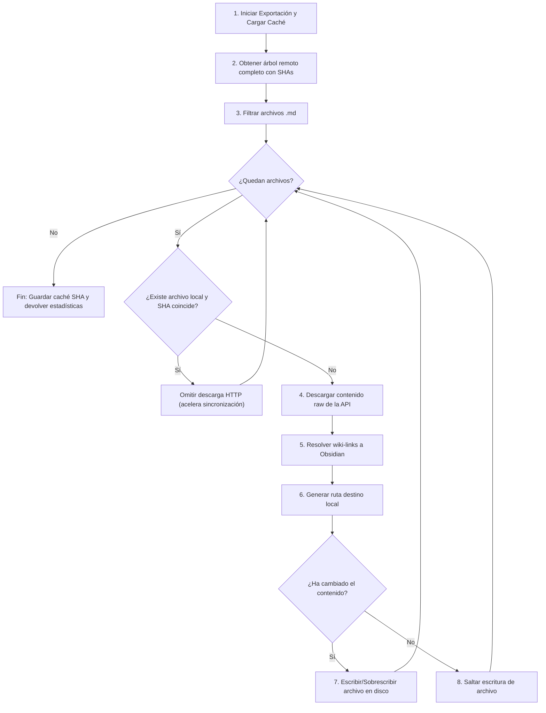

# Clase `obsidian_exporter`

Ubicación: `classes/obsidian_exporter.php`

```php
--8<-- "gitmetrics/classes/obsidian_exporter.php:class_desc"
```

## Diagrama de Flujo Principal


```mermaid
graph TD
    A["1. Iniciar Exportación y Cargar Caché"] --> B["2. Obtener árbol remoto completo con SHAs"]
    B --> C["3. Filtrar archivos .md"]
    C --> D{"¿Quedan archivos?"}
    D -- No --> E["Fin: Guardar caché SHA y devolver estadísticas"]
    D -- Sí --> F{"¿Existe archivo local y SHA coincide?"}
    F -- Sí --> L["Omitir descarga HTTP (acelera sincronización)"]
    F -- No --> G["4. Descargar contenido raw de la API"]
    G --> H["5. Resolver wiki-links a Obsidian"]
    H --> I["6. Generar ruta destino local"]
    I --> J{"¿Ha cambiado el contenido?"}
    J -- Sí --> K["7. Escribir/Sobrescribir archivo en disco"]
    J -- No --> M["8. Saltar escritura de archivo"]
    K --> D
    M --> D
    L --> D
```

### Detalle de los Pasos del Flujo

1. **[PASO 1] Iniciar Exportación y Cargar Caché:** Se invoca el método `export()` con los datos del repositorio y el cliente de Git ya inicializado. Se lee el archivo de caché local `.obsidian_sync_cache.json` que almacena los SHAs del último sync.
2. **[PASO 2] Obtener árbol remoto completo con SHAs:** A través de la API de GitHub/GitLab, se solicita la lista recursiva de todos los archivos del repositorio en la rama indicada, obteniendo sus rutas y hashes SHA del blob Git.
3. **[PASO 3] Filtrar archivos .md:** Se descartan todos los ficheros que no sean blobs con extensión `.md`.
4. **[PASO 4] Comprobar Caché SHA:** Si el archivo ya existe localmente y su hash SHA1 del árbol Git remoto es idéntico al guardado en la caché local, se **omite por completo la petición HTTP de descarga**, haciendo el proceso casi instantáneo.
5. **[PASO 5] Descargar contenido raw:** Para cada fichero nuevo o modificado remotamente, se descarga su contenido de texto desde el repositorio a la memoria temporal.
6. **[PASO 6] Resolver wiki-links a Obsidian:** Se analiza el texto usando expresiones regulares para convertir enlaces largos (ej: `[[carpeta/archivo|Texto]]`) en enlaces cortos nativos de Obsidian (`[[archivo|Texto]]`).
7. **[PASO 7] Generar ruta y escribir en disco:** Se calcula en qué subcarpeta del vault debe guardarse el fichero, creando carpetas si no existen. Si el contenido difiere del disco duro, se sobrescribe físicamente.
8. **[PASO 8] Guardar Caché y Saltar archivo:** Al finalizar la iteración, se guarda la nueva tabla de hashes de Git en el archivo `.obsidian_sync_cache.json` del vault.

## Funciones Principales

### `__construct`
Constructor de la clase. Recibe la URL del repositorio, el cliente de Git instanciado y extrae el *owner* y el *repo* necesarios para las llamadas a la API.

```php
--8<-- "gitmetrics/classes/obsidian_exporter.php:__construct"
```


### `export`
Ejecuta la exportación completa iterando sobre todos los archivos `.md`, comprobando la caché local de hashes SHA de Git, procesándolos y guardándolos localmente. Devuelve estadísticas sobre los ficheros escritos, saltados o con errores.

```php
--8<-- "gitmetrics/classes/obsidian_exporter.php:export"
```


### `resolve_wikilinks`
Transforma los `[[wiki-links]]` del estándar de repositorio OKF al formato plano nativo de Obsidian (extrayendo únicamente el *basename* de cada archivo).

```php
--8<-- "gitmetrics/classes/obsidian_exporter.php:resolve_wikilinks"
```


### `get_obsidian_uri`
Método estático de utilidad para construir una URL de protocolo `obsidian://` que permite abrir una nota específica directamente en la aplicación de escritorio.

```php
--8<-- "gitmetrics/classes/obsidian_exporter.php:get_obsidian_uri"
```

