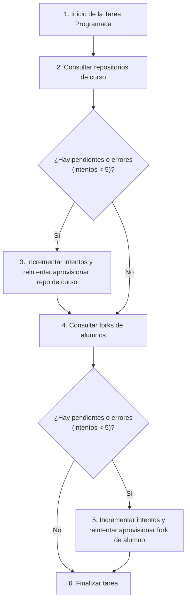

# Clase `retry_provisioning`

Ubicación: `classes/task/retry_provisioning.php`

```php
--8<-- "gitmetrics/classes/task/retry_provisioning.php:class_desc"
```

## Diagrama de Flujo Principal



### Detalle de los Pasos del Flujo
1. **[PASO 1] Ejecución Automática:** La tarea es invocada por el subsistema cron de Moodle según lo configurado en `db/tasks.php`.
2. **[PASO 2] Repositorios de Curso:** Busca en `block_gitmetrics_course_repo` filas que requieran un reintento y cuyo límite no haya excedido 5.
3. **[PASO 3] Aprovisionar Curso:** Invoca el método estático `observer::provision_course_repo` con el primer profesor de edición del curso (o el administrador como fallback).
4. **[PASO 4] Forks de Alumnos:** Busca en `block_gitmetrics_student_fork` filas que no pudieron crearse y cuyo límite no haya excedido 5.
5. **[PASO 5] Aprovisionar Fork:** Llama a `observer::provision_student_fork` para realizar una nueva petición a la API de GitHub/GitLab.
6. **[PASO 6] Finalización:** Deja constancia en el log (`mtrace`) sobre los reintentos cursados.

## Funciones Principales

### `get_name(): string`
Devuelve el nombre legible de la tarea (se muestra en el panel de Tareas Programadas de Moodle).

```php
--8<-- "gitmetrics/classes/task/retry_provisioning.php:get_name"
```

### `execute(): void`
Implementa directamente los pasos del flujo descritos en la sección anterior para iterar los registros en la base de datos y lanzar las llamadas de aprovisionamiento.

```php
--8<-- "gitmetrics/classes/task/retry_provisioning.php:execute"
```
