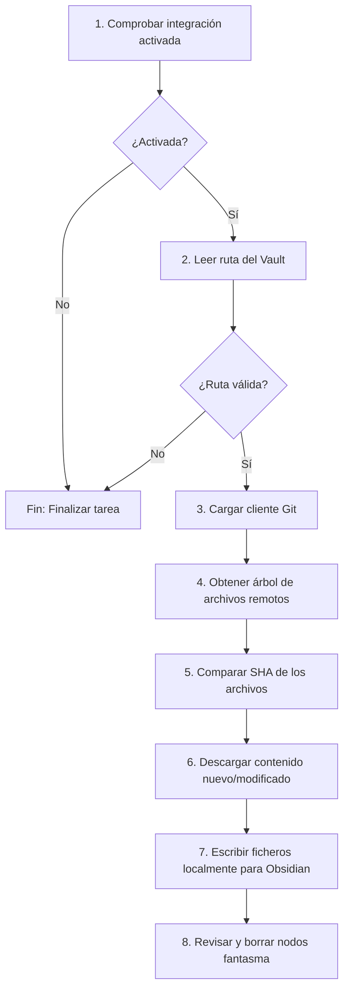

# Clase `sync_obsidian`

Ubicación: `classes/task/sync_obsidian.php`

--8<-- "gitmetrics/classes/task/sync_obsidian.php:class_desc"

## Diagrama de Flujo Principal



### Detalle de los Pasos del Flujo
1. **[PASO 1] Comprobar si la integración está activada:** Se verifica en los ajustes de Moodle. Si no lo está, se cancela la tarea.
2. **[PASO 2] Leer la ruta del Vault de Obsidian:** Se recupera la ruta del disco duro (ej: `/obsidian-vault`) donde se almacenarán los apuntes.
3. **[PASO 3] Cargar el cliente de Git:** Se inicializa la conexión leyendo el token, la URL y la rama desde los ajustes.
4. **[PASO 4] Obtener el "Árbol" (Tree) de archivos:** Se descarga desde la API la estructura completa remota, incluyendo el tipo de fichero, ruta y su `id` (SHA).
5. **[PASO 5] Comprobar archivos modificados:** Se determina si un fichero ha cambiado comparando su identificador SHA actual con el anterior.
6. **[PASO 6] Descargar contenido:** Se solicita el texto de los archivos detectados como nuevos o modificados.
7. **[PASO 7] Mandar los datos a Obsidian:** Moodle guarda el archivo físicamente en la carpeta local (usando `file_put_contents`). Obsidian lo detecta instantáneamente.
8. **[PASO 8] Revisar archivos borrados [Por implementar]:** Se comparan los archivos de la carpeta local con los de Git para borrar aquellos que sobren en local (nodos fantasma).

## Funciones Principales

### `get_name(): string`
Devuelve el nombre legible de la tarea (se muestra en el panel de Tareas Programadas de Moodle).

```php
--8<-- "gitmetrics/classes/task/sync_obsidian.php:get_name"
```

### `execute(): void`
Implementa directamente los pasos del flujo descritos en la sección anterior para sincronizar el repositorio. Finalmente imprime por el log del cron (`mtrace`) un resumen del número de ficheros escritos o saltados.

```php
--8<-- "gitmetrics/classes/task/sync_obsidian.php:execute"
```
