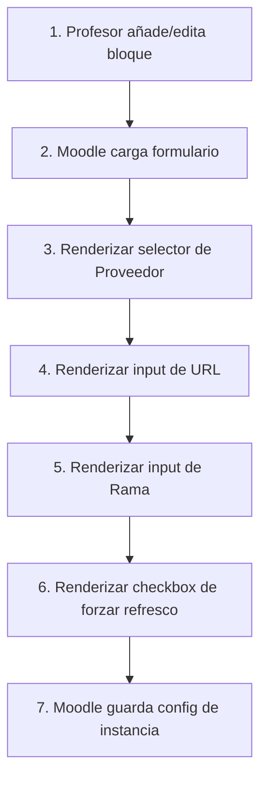

Crear archivo en: `docs/gitmetrics/edit_form.md`

# Archivo `edit_form`

Ubicación: `edit_form.php`

--8<-- "gitmetrics/edit_form.php:file_desc"

## Diagrama de Flujo Principal



### Detalle de los Pasos del Flujo

1. **[PASO 1] Edición iniciada:** El profesor activa el modo de edición en un curso y añade el bloque o pulsa en la rueda dentada de configuración del mismo.
2. **[PASO 2] Carga de formulario:** Moodle detecta que el bloque extiende `block_edit_form` y llama internamente al método `specific_definition`.
3. **[PASO 3] Proveedor:** Se añade un desplegable (`select`) para que el profesor elija entre GitHub o GitLab, heredando el valor por defecto configurado por el administrador globalmente.
4. **[PASO 4] URL:** Se añade un campo de texto normalizado a formato URL (`PARAM_URL`) para pegar el enlace al repositorio (ej. https://github.com/usuario/repo).
5. **[PASO 5] Rama:** Se añade un campo de texto opcionalizado (`PARAM_ALPHANUMEXT`) para designar una rama específica (por defecto "main").
6. **[PASO 6] Forzar refresco:** Se incluye un checkbox avanzado (`advcheckbox`) que, en caso de ser pulsado, instruye al bloque principal para invalidar la caché de métricas en su próxima carga.
7. **[PASO 7] Guardado:** Al pulsar "Guardar cambios", los datos pasan a la base de datos local y pueden ser consultados a través de `$this->config` en el archivo principal del bloque.

## Funciones Principales

### `specific_definition`
Función obligatoria dictada por la API de bloques de Moodle (`block_edit_form`) que define los elementos HTML utilizando la librería MoodleQuickForm (un fork de HTML_QuickForm).

```php
--8<-- "gitmetrics/edit_form.php:specific_definition"
```
