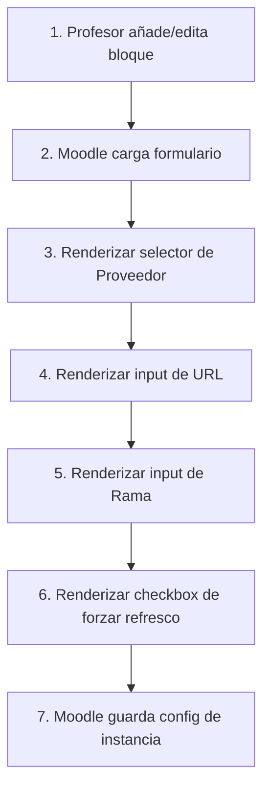

Crear archivo en: `docs/gitmetrics/edit_form.md`

# Archivo `edit_form`

Ubicación: `edit_form.php`

```python
Formulario de configuracion por instancia del bloque.
El profesor elige el proveedor (GitHub o GitLab) y pega la URL
del repositorio que desea analizar en su asignatura o curso.
```

## Diagrama de Flujo Principal


```mermaid
graph TD
    A["1. Profesor añade/edita bloque"] --> B["2. Moodle carga formulario"]
    B --> C["3. Renderizar selector de Proveedor"]
    C --> D["4. Renderizar input de URL"]
    D --> E["5. Renderizar input de Rama"]
    E --> F["6. Renderizar checkbox de forzar refresco"]
    F --> G["7. Moodle guarda config de instancia"]
```

### Detalle de los Pasos del Flujo

1. **[PASO 1] Edición iniciada:** El profesor activa el modo de edición en un curso y añade el bloque o pulsa en la rueda dentada de configuración del mismo.
2. **[PASO 2] Carga de formulario:** Moodle detecta que el bloque extiende `block_edit_form` y llama internamente al método `specific_definition`.
3. **[PASO 3] Proveedor:** Se añade un desplegable (`select`) para que el profesor elija entre GitHub o GitLab, heredando el valor por defecto configurado por el administrador globalmente.
4. **[PASO 4] URL:** Se añade un campo de texto normalizado a formato URL (`PARAM_URL`) para pegar el enlace al repositorio (ej. https://github.com/usuario/repo).
5. **[PASO 5] Rama:** Se añade un campo de texto opcionalizado (`PARAM_ALPHANUMEXT`) para designar una rama específica (por defecto "main").
6. **[PASO 6] Forzar refresco:** Se incluye un checkbox avanzado (`advcheckbox`) que, en caso de ser pulsado, instruye al bloque principal para invalidar la caché de métricas en su próxima carga.
7. **[PASO 7] Guardado:** Al pulsar "Guardar cambios", los datos pasan a la base de datos local y pueden ser consultados a través de `$this->config` en el archivo principal del bloque.

## Funciones Principales

### `specific_definition`
Función obligatoria dictada por la API de bloques de Moodle (`block_edit_form`) que define los elementos HTML utilizando la librería MoodleQuickForm (un fork de HTML_QuickForm).

```php
```python
protected function specific_definition($mform) {

    // -- Seccion principal ----------------------------------------------
    $mform->addElement('header', 'configheader', get_string('blocksettings', 'block'));

    // Proveedor Git
    $mform->addElement(
        'select',
        'config_provider',
        get_string('provider', 'block_gitmetrics'),
        [
            'github' => get_string('provider_github', 'block_gitmetrics'),
            'gitlab' => get_string('provider_gitlab', 'block_gitmetrics'),
        ]
    );
    $mform->setType('config_provider', PARAM_ALPHA);
    $default_provider = get_config('block_gitmetrics', 'default_provider') ?: 'github';
    $mform->setDefault('config_provider', $default_provider);
    $mform->addHelpButton('config_provider', 'provider', 'block_gitmetrics');

    // URL del repositorio (GitHub o GitLab)
    $mform->addElement(
        'text',
        'config_repo_url',
        get_string('repo_url', 'block_gitmetrics'),
        ['size' => 65, 'placeholder' => 'https://github.com/usuario/repositorio  o  https://gitlab.osl.ugr.es/grupo/repositorio']
    );
    $mform->setType('config_repo_url', PARAM_URL);
    $mform->addHelpButton('config_repo_url', 'repo_url', 'block_gitmetrics');

    // Rama del repositorio (opcional, por defecto 'main')
    $mform->addElement(
        'text',
        'config_branch',
        get_string('branch', 'block_gitmetrics'),
        ['size' => 20, 'placeholder' => 'main']
    );
    $mform->setType('config_branch', PARAM_ALPHANUMEXT);
    $mform->setDefault('config_branch', 'main');

    // Forzar refresco de cache
    $mform->addElement(
        'advcheckbox',
        'config_force_refresh',
        get_string('force_refresh', 'block_gitmetrics'),
        get_string('force_refresh_desc', 'block_gitmetrics')
    );
    $mform->setType('config_force_refresh', PARAM_BOOL);
    $mform->setDefault('config_force_refresh', 0);
}
// 
```

