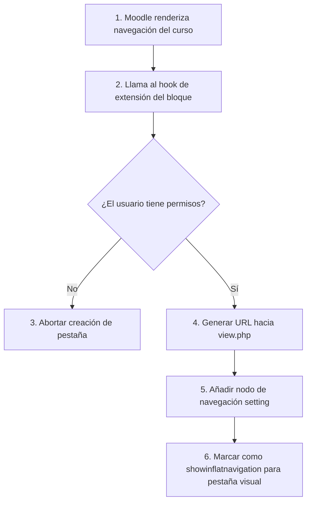

Crear archivo en: `docs/gitmetrics/lib.md`

# Archivo `lib.php`

Ubicación: `lib.php`

--8<-- "gitmetrics/lib.php:file_desc"

## Diagrama de Flujo Principal



### Detalle de los Pasos del Flujo

1. **[PASO 1] Renderizado de Moodle:** Cuando un usuario entra a un curso, el núcleo (Core) de Moodle construye el árbol de navegación.
2. **[PASO 2] Invocación del Hook:** Moodle busca automáticamente funciones con el formato estandarizado `*_extend_navigation_course` en todos los archivos `lib.php` de sus plugins y los ejecuta.
3. **[PASO 3] Validación de permisos:** La función comprueba si el usuario activo tiene la *capability* `moodle/course:view` en el contexto actual. Si no (ej. usuario deslogueado o sin matrícula), se cancela la adición de la pestaña para evitar fugas de información.
4. **[PASO 4] Generación de URL:** Se prepara la dirección web apuntando a `view.php` del plugin, adjuntándole por query string el ID del curso actual.
5. **[PASO 5] Creación del Nodo:** Se inserta un nuevo objeto hijo en el árbol de navegación del curso con el icono correspondiente.
6. **[PASO 6] Boost UI:** Gracias a la propiedad `showinflatnavigation = true`, los temas modernos como Boost extraen este nodo del árbol lateral y lo incrustan directamente como una pestaña horizontal en la cabecera principal del curso.

## Funciones Principales

### `block_gitmetrics_extend_navigation_course`
Función Core Hook (gancho del núcleo). Permite a los plugins modificar dinámicamente el árbol de navegación inyectando enlaces a sus propias vistas.

```php
--8<-- "gitmetrics/lib.php:block_gitmetrics_extend_navigation_course"
```
