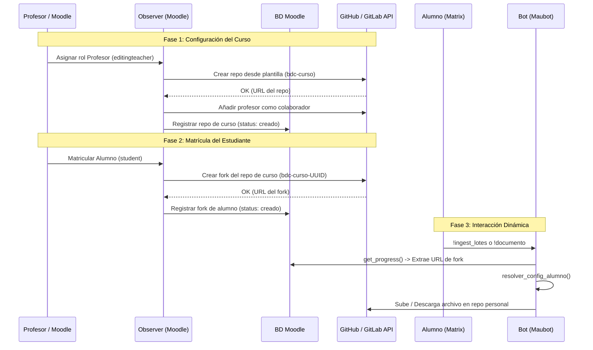

# Aprovisionamiento de Repos de Alumno — Decisiones de Arquitectura

> [!IMPORTANT]
> Este documento recoge las decisiones de diseño del flujo de creación automática de repositorios personales de alumno. Debe leerse antes de tocar cualquier fichero relacionado con el aprovisionamiento (Pasos 1-6 del plan).

---

# Aprovisionamiento de Repos de Alumno — Decisiones de Arquitectura y Flujo End-to-End

> [!IMPORTANT]
> Este documento recoge el diseño final del flujo completo de creación automática de repositorios personales de alumno, implementado a lo largo de los Pasos 1 a 10 de la arquitectura.

---

## 1. Flujo End-to-End (De Moodle al Bot)

El aprovisionamiento dinámico de repositorios y forks ahora está guiado y orquestado enteramente desde **Moodle**, garantizando que todos los usuarios tengan su base de conocimiento preparada antes incluso de hablar con el bot.

### 1.1 Repo de Curso (Plantilla Base)
Cuando se asigna un profesor con permisos de edición (`editingteacher`) a un curso:
1. El `observer::teacher_assigned` de Moodle detecta el evento de matriculación.
2. Comprueba si ya existe un repositorio base para ese curso en la tabla `block_gitmetrics_course_repo`.
3. Si no existe, invoca la API de GitHub/GitLab (vía `github_client`) para crear un repositorio desde la plantilla configurada (`template_repo`) utilizando el token de administrador.
4. El repositorio recibe el nombre `bdc-<curso_shortname>`.
5. Automáticamente se añade al profesor como colaborador (`maintainer`).

### 1.2 Fork por Alumno
Cuando se matricula a un alumno con el rol `student`:
1. El `observer::student_enrolled` entra en acción.
2. Identifica el repositorio base del curso asociado.
3. Solicita a la API un **fork** del repositorio base hacia el namespace destino, nombrándolo con el UUID pseudónimo del alumno: `bdc-<curso_shortname>-<id_pseudo>`.
4. El registro se guarda en la tabla `block_gitmetrics_student_fork` y el estado pasa a `creado`.

### 1.3 Mapeo Room ↔ Curso en Matrix
1. Cuando se crea un curso en Moodle, `matrix_helper::ensure_room_and_bot` crea la sala en Matrix.
2. Envía un state event `es.ugr.gitmetrics.course_link` con el `course_id`.
3. Esto sirve para que, posteriormente, el bot asocie la sala de chat a la identidad del curso en Moodle, lo cual es vital para saber qué métricas consultar.

### 1.4 Cómo lo usa el Bot (Resolución Dinámica)
Cuando el alumno habla con el LLM Wiki Assistant en Matrix:
1. El bot sabe en qué sala se encuentra y por tanto extrae el `course_id`.
2. Lee la base de datos de Moodle (o pregunta al endpoint de progreso) para mapear el ID del alumno con la URL de su fork personal.
3. El módulo `git_client.py` en el bot ejecuta `resolver_config_alumno()`, que intercepta los parámetros genéricos e inyecta la URL y el nombre exacto del repositorio del alumno para esa consulta o escritura particular.
4. Así, cada alumno tiene su propio contexto Git dinámico sin afectar a la configuración global del bot.

### 1.5 Panel de Gestión Docente
Todo este progreso de aprovisionamiento se monitoriza en la vista del bloque Gitmetrics:
1. Si el usuario que accede tiene permisos de edición (profesor), se muestra el "Panel de Gestión: Forks y Progreso de Sesiones".
2. Combina el estado de `block_gitmetrics_course_repo` y la tabla de `block_gitmetrics_student_fork`.
3. Si un fork de alumno falla en su creación (por cortes de API o tokens mal configurados), aparece el mensaje de error explícito.
4. El profesor puede hacer clic en **Reintentar**, que llama al mismo método original del observer (`provision_student_fork`).

### 1.6 Tarea de Reintentos Automáticos
Existe la tarea programada `block_gitmetrics\task\retry_provisioning`:
1. Se ejecuta automáticamente cada 15 minutos (por defecto).
2. Barre las tablas en busca de repos de cursos o forks que estén en estado `pendiente` o en `error`.
3. Incrementa la columna `attempts`. Si el número de intentos es menor a 5, llama a los métodos de aprovisionamiento del observer.
4. Si falla de manera reiterada (> 5 intentos), lo deja en estado de error definitivo para que lo revise el administrador (o el profesor mediante el reintento manual que ignora este contador).

---

## 2. Diagrama Completo del Ecosistema

---

## 3. Credenciales necesarias — Token de GitHub

El token de servicio que el plugin usa para crear repos de alumno es el **mismo** `github_token` ya configurado en los ajustes globales del plugin (`block_gitmetrics/github_token`).

> [!WARNING]
> El token configurado solo necesita `public_repo` (lectura pública) para leer métricas. El aprovisionamiento requiere **scopes adicionales**. Actualiza el token antes de usar esta característica.

### Scopes requeridos

| Scope | Por qué es necesario | Cuándo se necesita |
|---|---|---|
| `repo` | Crear repositorios privados, leer y escribir contenido, configurar ramas y protecciones. Cubre tanto la creación desde plantilla como la creación de forks. | **Siempre** (independientemente de si los repos son públicos o privados) |
| `admin:org` → sub-scope `write:org` | Invitar a un miembro a una organización y añadirlo como colaborador de un repo dentro de la org. | **Solo si `target_namespace` es una organización de GitHub** (no una cuenta personal) |

> [!NOTE]
> Con cuenta **personal** (`target_namespace` = tu usuario de GitHub), `repo` es suficiente para crear repositorios y añadir colaboradores directamente.

### Cómo crear o actualizar el token

1. Ve a **GitHub → Settings → Developer settings → Personal access tokens → Fine-grained tokens** (recomendado) o **Tokens (classic)**.
2. Para **fine-grained token** (más seguro):
   - *Repository access*: "All repositories" o selecciona el namespace `target_namespace`.
   - *Permissions → Repository*: `Contents` → Read and write, `Administration` → Read and write.
   - *Permissions → Organization* (si aplica): `Members` → Read and write.
3. Para **token clásico** (más sencillo en dev):
   - Marca los scopes `repo` y, si usas org, `admin:org`.
4. Copia el token y pégalo en **Administración del sitio → Plugins → Bloques → GitMetrics → GitHub API Token**.
