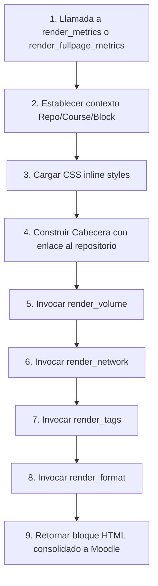

Crear archivo en: `docs/gitmetrics/renderer.md`

# Clase `block_gitmetrics_renderer`

Ubicación: `renderer.php`

--8<-- "gitmetrics/renderer.php:file_desc"

## Diagrama de Flujo Principal



### Detalle de los Pasos del Flujo

1. **[PASO 1] Invocación de renderizado:** Las páginas `block_gitmetrics.php` (para el bloque pequeño lateral) o `view.php` (para la página completa) instancian el renderer y le pasan el array completo `$metrics`.
2. **[PASO 2] Contexto:** Se inicializan las variables privadas con el ID del curso, instancia del bloque y URLs para poder construir posteriormente los enlaces en las tablas a `view_file.php`.
3. **[PASO 3] CSS Inline:** Se inyecta la función `styles()` (heredera del diseño *Tailwind/Boost* inspirado) sin requerir registrar un CSS global en Moodle.
4. **[PASO 4] Cabecera:** Renderiza el título del bloque junto con los enlaces directos a la plataforma de origen (GitHub/GitLab) y la rama (badge ⎇).
5. **[PASO 5] Volumen:** Procesa el subarray `volume` renderizando tarjetas de métricas estáticas y la tabla de archivos esenciales.
6. **[PASO 6] Red:** Procesa el subarray `network` generando barras de progreso de densidad de enlaces y tablas descriptivas de nodos huérfanos.
7. **[PASO 7] Etiquetas:** Procesa el subarray `tags` generando la "Nube de Etiquetas" iterando a través de las frecuencias absolutas.
8. **[PASO 8] Formato:** Procesa el subarray `format` mostrando las tasas de frontmatter válido y renderizando menús colapsables (`<details>`) con las listas de errores Markdown en bruto.
9. **[PASO 9] Retorno:** Toda la cadena se devuelve puramente como HTML.

## Funciones Principales

### `render_metrics`
Genera la vista reducida para el panel lateral de Moodle. Incluye un botón para abrir la vista completa.

```php
--8<-- "gitmetrics/renderer.php:render_metrics"
```

### `render_fullpage_metrics`
Genera la vista expandida (utilizada en `view.php`). Distribuye las secciones en contenedores `<details>` desplegables permitiendo analizar toda la estructura sin limitación de ancho.

```php
--8<-- "gitmetrics/renderer.php:render_fullpage_metrics"
```

### `render_volume`
Construye visualmente el bloque de estadísticas de peso y la tabla colapsable de "Archivos individuales".

```php
--8<-- "gitmetrics/renderer.php:render_volume"
```

### `render_network`
Construye visualmente el análisis grafos y la tabla de conexiones salientes/entrantes para detectar archivos huérfanos.

```php
--8<-- "gitmetrics/renderer.php:render_network"
```

### `render_tags`
Construye el resumen de metadatos YAML y la nube proporcional de etiquetas (cuyo tamaño de fuente se calcula algorítmicamente mediante `(freq/max)*10 + base`).

```php
--8<-- "gitmetrics/renderer.php:render_tags"
```

### `render_format`
Presenta el feedback de salud de Markdown, coloreando dinámicamente las tarjetas en rojo/naranja/verde según el porcentaje de validez.

```php
--8<-- "gitmetrics/renderer.php:render_format"
```
