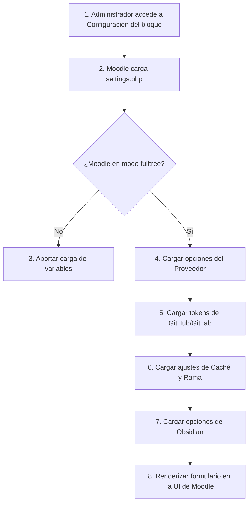

Crear archivo en: `docs/gitmetrics/settings.md`

# Archivo `settings`

Ubicación: `settings.php`

--8<-- "gitmetrics/settings.php:file_desc"

## Diagrama de Flujo Principal



### Detalle de los Pasos del Flujo

1. **[PASO 1] Acceso a Configuración:** El administrador navega al menú de Plugins de Moodle y selecciona la configuración global del bloque Gitmetrics.
2. **[PASO 2] Carga del fichero:** El motor (core) de administración de Moodle importa este archivo para saber qué campos debe pintar.
3. **[PASO 3] Validación fulltree:** Para evitar consumir memoria innecesaria en cada carga de página de la web, todos los bloques envuelven su configuración en `if ($ADMIN->fulltree)`.
4. **[PASO 4] Proveedor por Defecto:** Se define el bloque de selección para que Moodle decida si prioriza GitHub o GitLab a nivel global.
5. **[PASO 5] Tokens:** Se configuran los campos de contraseñas desenmascarables (`admin_setting_configpasswordunmask`) para almacenar de forma segura los Tokens REST privados.
6. **[PASO 6] Caché:** Se habilita la configuración del TTL (en segundos) para limitar las peticiones externas al API de los repositorios.
7. **[PASO 7] Obsidian:** Finalmente se exponen los parámetros relativos a las tareas locales de Obsidian.
8. **[PASO 8] Renderización:** Moodle utiliza estos objetos y parámetros (como `PARAM_URL` o `PARAM_ALPHANUMEXT`) para dibujar la página final y gestionar su validación y sanitizado automáticamente.

## Funciones Principales

### `Definición de Ajustes (settings_definition)`
Código procedural encargado de registrar progresivamente todas las variables en la categoría global del bloque dentro del árbol de administración de Moodle.

```php
--8<-- "gitmetrics/settings.php:settings_definition"
```
