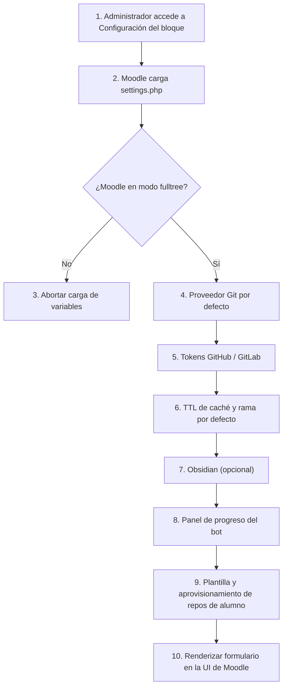

# `settings.php`

Ubicación: `gitmetrics/settings.php`

```php
--8<-- "gitmetrics/settings.php:file_desc"
```

## Diagrama de Flujo Principal


```mermaid
graph TD
    A["1. Administrador accede a Configuración del bloque"] --> B["2. Moodle carga settings.php"]
    B --> C{"¿Moodle en modo fulltree?"}
    C -->|"No"| D["3. Abortar carga de variables"]
    C -->|"Sí"| E["4. Proveedor Git por defecto"]
    E --> F["5. Tokens GitHub / GitLab"]
    F --> G["6. TTL de caché y rama por defecto"]
    G --> H["7. Obsidian (opcional)"]
    H --> I["8. Panel de progreso del bot"]
    I --> J["9. Plantilla y aprovisionamiento de repos de alumno"]
    J --> K["10. Renderizar formulario en la UI de Moodle"]
```

### Detalle de los pasos

1. **Acceso a configuración:** El administrador navega a *Administración del sitio → Plugins → Bloques → GitMetrics*.
2. **Carga del fichero:** El núcleo de administración de Moodle importa `settings.php`.
3. **Validación `fulltree`:** Todos los bloques envuelven su configuración en `if ($ADMIN->fulltree)` para no consumir memoria en cada carga de página.
4. **Proveedor por defecto:** Selector entre GitHub y GitLab para nuevas instancias de bloque.
5. **Tokens:** Campos de contraseña (`configpasswordunmask`) para los tokens de la API.
6. **Caché:** TTL en segundos y rama Git por defecto.
7. **Obsidian:** Parámetros opcionales; se pueden eliminar completamente si no se usa.
8. **Panel de progreso:** URL y token Bearer del endpoint `/progreso` del bot Maubot.
9. **Plantilla y aprovisionamiento:** Los cuatro campos que controlan el fork de repos de alumno — ver tabla más abajo.
10. **Renderización:** Moodle usa los tipos `PARAM_*` para dibujar y validar el formulario automáticamente.

## Ajustes existentes

### Proveedor y tokens

| Clave de configuración | Tipo | Valor por defecto | Descripción |
|---|---|---|---|
| `block_gitmetrics/default_provider` | select | `github` | Proveedor Git usado por defecto al crear una instancia de bloque |
| `block_gitmetrics/github_token` | password | `` | Token de API de GitHub (60 req/h sin token, 5000/h con él) |
| `block_gitmetrics/gitlab_url` | text/URL | `https://gitlab.com` | URL base del servidor GitLab |
| `block_gitmetrics/gitlab_token` | password | `` | PRIVATE-TOKEN de GitLab |

### General

| Clave de configuración | Tipo | Valor por defecto | Descripción |
|---|---|---|---|
| `block_gitmetrics/cache_ttl` | int | `3600` | TTL de la caché de métricas en segundos |
| `block_gitmetrics/default_branch` | text | `main` | Rama Git analizada si el bloque no especifica una |

### Obsidian (opcional)

| Clave de configuración | Tipo | Valor por defecto | Descripción |
|---|---|---|---|
| `block_gitmetrics/obsidian_enabled` | checkbox | `0` | Activa/desactiva el botón Obsidian junto a cada documento |
| `block_gitmetrics/obsidian_vault_path` | text | `` | Ruta absoluta del vault en el sistema de archivos del usuario |
| `block_gitmetrics/obsidian_vault_name` | text | `OKF-Vault` | Nombre de la carpeta del vault (para construir los enlaces `obsidian://`) |

### Panel de progreso del bot Maubot

| Clave de configuración | Tipo | Valor por defecto | Descripción |
|---|---|---|---|
| `block_gitmetrics/bot_progress_url` | URL | `` | URL del endpoint `/progreso` del bot (p. ej. `http://maubot:29316/...`) |
| `block_gitmetrics/bot_progress_token` | password | `` | Token Bearer que autentica las peticiones al endpoint |

## Ajustes nuevos (Paso 0) — Plantilla y aprovisionamiento de repos de alumno

Estos cuatro ajustes centralizan **toda** la información necesaria para forkar el repo plantilla y crear el repo personal de cada alumno. **Ningún fichero `.php` ni `.py` debe leer estos valores de otro sitio que no sea `get_config()`**; el día que se pase de la cuenta de desarrollo a la cuenta de la universidad, el cambio se limita a editar estos campos desde la UI de Moodle — sin tocar código.

| Clave de configuración | Tipo | Valor por defecto | Descripción |
|---|---|---|---|
| `block_gitmetrics/template_owner` | text | `julia8873` | Usuario u organización de GitHub/GitLab donde vive el repo plantilla. En desarrollo: `julia8873`; en producción: cuenta/org de la universidad. |
| `block_gitmetrics/template_repo` | text | `BdC-template` | Nombre del repositorio plantilla. Debe existir bajo `template_owner` y estar marcado como *Template repository* en GitHub. |
| `block_gitmetrics/template_provider` | select | `github` | Proveedor donde vive la plantilla y donde se crearán los repos de alumno. Actualmente solo GitHub soporta la API de creación por plantilla (`generate from template`). |
| `block_gitmetrics/target_namespace` | text | `` | Cuenta personal u organización donde se crearán los repos de alumno (p. ej. `julia8873` en local, `ugr-cursos` en producción). Si se deja vacío se usa la cuenta propietaria del token. Para múltiples profesores se recomienda una organización de GitHub. |

!!! warning "Centralización obligatoria"
    `target_namespace` puede quedar vacío si se usa cuenta personal, pero **nunca** debe estar escrito a fuego en un `.php` o `.py`. Si en algún momento ves `julia8873` o `BdC-template` fuera de comentarios/documentación, es una señal de que se está rompiendo esta centralización.

## Código fuente

### Descripción del fichero

```php
--8<-- "gitmetrics/settings.php:file_desc"
```

### Definición de ajustes

```php
--8<-- "gitmetrics/settings.php:settings_definition"
```

### Ajustes de plantilla y aprovisionamiento

```php
--8<-- "gitmetrics/settings.php:template_settings"
```
