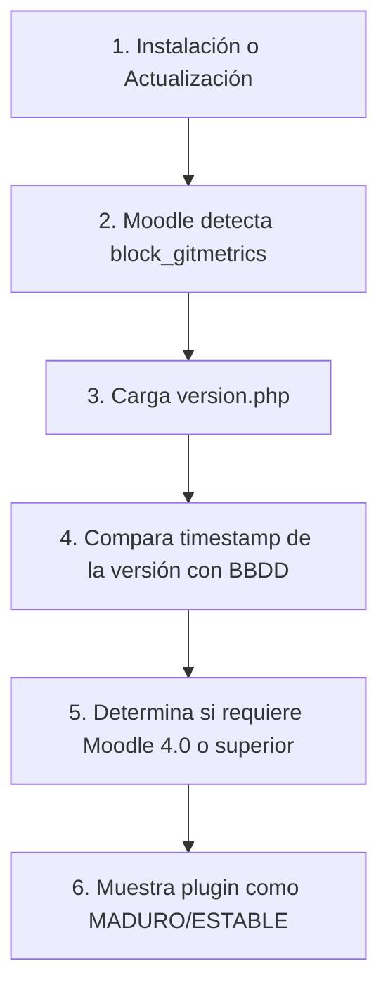

Crear archivo en: `docs/gitmetrics/version.md`

# Archivo `version`

Ubicación: `version.php`

--8<-- "gitmetrics/version.php:file_desc"

## Diagrama de Flujo Principal



### Detalle de los Pasos del Flujo

1. **[PASO 1] Evento desencadenante:** El administrador entra en "Notificaciones" o lanza el script CLI de actualización, desencadenando la revisión de la carpeta de plugins.
2. **[PASO 2] Detección:** Moodle encuentra la carpeta `gitmetrics` bajo el directorio `blocks/`.
3. **[PASO 3] Carga obligatoria:** Inmediatamente parsea `version.php` para extraer la variable reservada global `$plugin`.
4. **[PASO 4] Comparación de versiones:** Moodle extrae `2026072100` y lo compara con el registro en la tabla `mdl_config_plugins` para averiguar si debe ejecutar un `upgrade.php` (no aplicable en este plugin).
5. **[PASO 5] Verificación de entorno:** Comprueba el atributo `requires` para asegurar que el sistema que está ejecutando la instalación es al menos la versión 4.0 de Moodle (`2022041900`).
6. **[PASO 6] Madurez:** Informa visualmente en la pantalla de revisión de plugins de Moodle que el código es estable y apto para producción (`MATURITY_STABLE`).

## Funciones Principales

### `Definición de Versión`
Asignación de variables al objeto estándar global `$plugin`. No contiene funciones, únicamente declaraciones paramétricas requeridas estrictamente por la API de plugins de Moodle.

```php
--8<-- "gitmetrics/version.php:version_definition"
```
