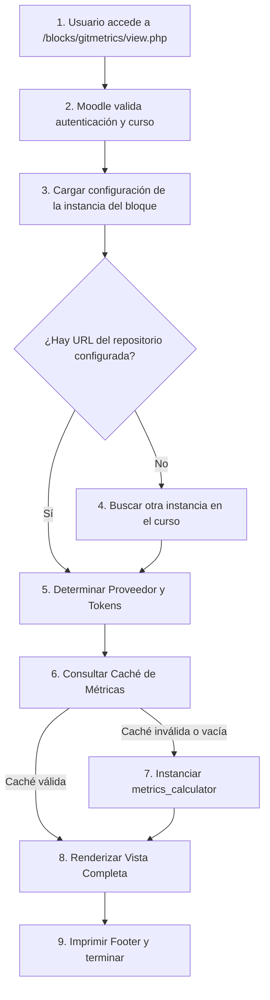

Crear archivo en: `docs/gitmetrics/view.md`

# Archivo `view`

Ubicación: `view.php`

--8<-- "gitmetrics/view.php:file_desc"

## Diagrama de Flujo Principal



### Detalle de los Pasos del Flujo

1. **[PASO 1] Acceso a la página:** El usuario hace clic en el botón "Ver en página completa" del bloque o en la pestaña del menú de navegación.
2. **[PASO 2] Seguridad:** Se exigen obligatoriamente los parámetros `courseid` y se fuerza el login con `require_login($course)`. Se configura el diseño global de la página (`$PAGE->set_pagelayout('report')`).
3. **[PASO 3] Carga de ajustes de Instancia:** Si se suministró un `blockid`, se extraen los datos (URL y rama) serializados desde `mdl_block_instances`.
4. **[PASO 4] Fallback de curso:** Si se accedió mediante la barra de navegación del curso (donde `blockid = 0`), el script busca activamente en la BDD cualquier instancia de Gitmetrics dentro de ese curso para robarle su URL de repositorio.
5. **[PASO 5] Credenciales:** Determina si el objetivo es GitHub o GitLab para extraer los tokens correctos de los ajustes globales.
6. **[PASO 6] Consulta a Caché:** Interroga al motor de caché (`metrics_cache`) proporcionándole la URL y el blockid.
7. **[PASO 7] Análisis en vivo:** En caso de miss en la caché, invoca al analizador (`metrics_calculator`) para descargar recursivamente la Base de Conocimiento y recalcular todas las variables.
8. **[PASO 8] Interfaz Expandida:** Utiliza la función `render_fullpage_metrics` del objeto `renderer` para dibujar las métricas a lo ancho de toda la pantalla usando componentes `<details>`.
9. **[PASO 9] Finalización:** El núcleo cierra la etiqueta de cuerpo del documento HTML devolviendo el resultado al navegador.

## Funciones Principales

### `Lógica de Renderizado y Caché`
Script procedural ejecutado bajo el contexto de Moodle que coordina el pintado del *header*, delegación del renderizado, y pintado del *footer*.

```php
--8<-- "gitmetrics/view.php:view_logic"
```
