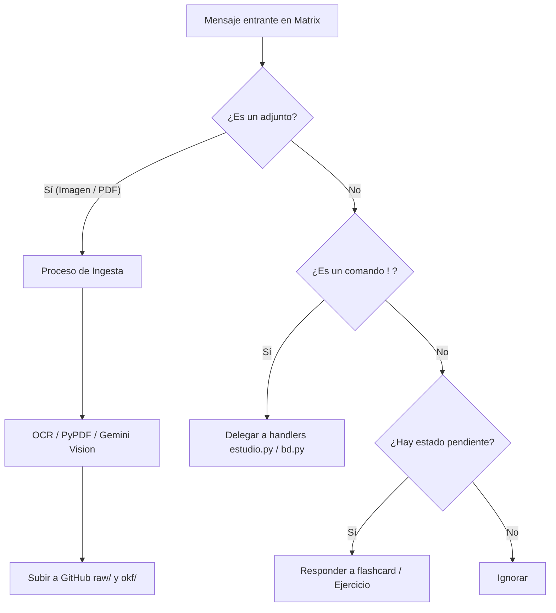

# Core: GithubBot (`bot.py`)

Ubicación: `moodle-matrix-dev/maubot/github-bot-plugin/github_bot/bot.py`

El archivo `bot.py` coordina la interacción entre el usuario (vía Matrix), la base de conocimientos (vía GitHub) y el motor de estudio.

## Descripción General

```python
--8<-- "moodle-matrix-dev/maubot/github-bot-plugin/github_bot/bot.py:file_desc"
```

## Diagrama de Interacción de Mensajes



## Ciclo de Vida y Concurrencia

El bot implementa un control de caché agresivo y manejo asíncrono avanzado con semáforos (`MAX_CONCURRENCIA_GITHUB`) para no exceder las cuotas de la API del proveedor (GitHub/GitLab) ni solapar transacciones concurrentes en el chat (`_user_locks`).

---

## Métodos de la Clase `GithubBot`

A continuación se documentan todos los métodos expuestos por el bot, divididos por su funcionalidad. El código se importa dinámicamente desde el archivo principal.

### Inicialización y Configuración

**`start`**
Punto de entrada de Maubot. Inicializa el bot, los semáforos de concurrencia y la conexión a la base de datos.
```python
--8<-- "moodle-matrix-dev/maubot/github-bot-plugin/github_bot/bot.py:start"
```

**`_obtener_git_token`**
Obtiene el token adecuado según el proveedor (GitLab o GitHub).
```python
--8<-- "moodle-matrix-dev/maubot/github-bot-plugin/github_bot/bot.py:obtener_git_token"
```

**`get_config_class` y `get_db_upgrade_table`**
Métodos de clase para enlazar la configuración del plugin y las migraciones de la base de datos.
```python
--8<-- "moodle-matrix-dev/maubot/github-bot-plugin/github_bot/bot.py:get_config_class"
```
```python
--8<-- "moodle-matrix-dev/maubot/github-bot-plugin/github_bot/bot.py:get_db_upgrade_table"
```

**`_get_user_lock` y `_invalidar_cache`**
Manejo de cerrojos de concurrencia por usuario y limpieza de caché tras operaciones de escritura.
```python
--8<-- "moodle-matrix-dev/maubot/github-bot-plugin/github_bot/bot.py:get_user_lock"
```
```python
--8<-- "moodle-matrix-dev/maubot/github-bot-plugin/github_bot/bot.py:invalidar_cache"
```

**`_crear_llm` y `_crear_llm_vision`**
Crea e inicializa las instancias del modelo de lenguaje (texto y visión).
```python
--8<-- "moodle-matrix-dev/maubot/github-bot-plugin/github_bot/bot.py:crear_llm"
```
```python
--8<-- "moodle-matrix-dev/maubot/github-bot-plugin/github_bot/bot.py:crear_llm_vision"
```

**`_responder_con_latex`**
Envía una respuesta por Matrix procesando previamente cualquier fórmula LaTeX para renderizarla como imagen PNG en un mensaje HTML.
```python
--8<-- "moodle-matrix-dev/maubot/github-bot-plugin/github_bot/bot.py:responder_con_latex"
```

---

### Exploración y Descarga de GitHub (Caché)

**`_obtener_documentacion`**
Obtiene la documentación o apuntes del repositorio Git.
```python
--8<-- "moodle-matrix-dev/maubot/github-bot-plugin/github_bot/bot.py:obtener_documentacion"
```

**`_recorrer_carpeta` y `_recorrer_carpeta_con_sha`**
Recorre una carpeta del repositorio, lista sus archivos y obtiene sus hashes SHA.
```python
--8<-- "moodle-matrix-dev/maubot/github-bot-plugin/github_bot/bot.py:recorrer_carpeta"
```
```python
--8<-- "moodle-matrix-dev/maubot/github-bot-plugin/github_bot/bot.py:recorrer_carpeta_con_sha"
```

**`_listar_rutas` y `_listar_carpetas`**
Lista las rutas y directorios disponibles en el repositorio utilizando la caché en memoria.
```python
--8<-- "moodle-matrix-dev/maubot/github-bot-plugin/github_bot/bot.py:listar_rutas"
```
```python
--8<-- "moodle-matrix-dev/maubot/github-bot-plugin/github_bot/bot.py:listar_carpetas"
```

**`_descargar_contenido_fichero` y `_descargar_adjunto`**
Descarga de archivos tanto del repositorio como adjuntos enviados a la sala de Matrix.
```python
--8<-- "moodle-matrix-dev/maubot/github-bot-plugin/github_bot/bot.py:descargar_contenido_fichero"
```
```python
--8<-- "moodle-matrix-dev/maubot/github-bot-plugin/github_bot/bot.py:descargar_adjunto"
```

---

### Ingesta de Fuentes y Manejo de Mensajes

**`on_message`**
Manejador principal de eventos de mensaje. Procesa todos los mensajes entrantes de la sala, evalúa candados de concurrencia y delega el flujo a los procesos de OCR o comandos.
```python
--8<-- "moodle-matrix-dev/maubot/github-bot-plugin/github_bot/bot.py:on_message"
```

**`_procesar_confirmacion_ocr`**
Procesa la decisión del usuario sobre si aplicar OCR multimodal exhaustivo o extracción de texto simple.
```python
--8<-- "moodle-matrix-dev/maubot/github-bot-plugin/github_bot/bot.py:procesar_confirmacion_ocr"
```

**`_encolar_para_lote` y `_debounce_lote`**
Mecanismo para agrupar múltiples subidas de archivos consecutivos y procesarlos como un único lote tras un retardo configurado (debounce).
```python
--8<-- "moodle-matrix-dev/maubot/github-bot-plugin/github_bot/bot.py:encolar_para_lote"
```
```python
--8<-- "moodle-matrix-dev/maubot/github-bot-plugin/github_bot/bot.py:debounce_lote"
```

**`_vista_previa_transcripcion`**
Genera una vista previa truncada del texto extraído de un documento para el usuario.
```python
--8<-- "moodle-matrix-dev/maubot/github-bot-plugin/github_bot/bot.py:vista_previa_transcripcion"
```

---

### Flujo de Destino y Organización de Archivos

**`_procesar_respuesta_destino` y `_procesar_renombrado`**
Coordinan el diálogo interactivo con el estudiante para decidir la carpeta final en el repositorio y si se debe modificar el nombre del archivo.
```python
--8<-- "moodle-matrix-dev/maubot/github-bot-plugin/github_bot/bot.py:procesar_respuesta_destino"
```
```python
--8<-- "moodle-matrix-dev/maubot/github-bot-plugin/github_bot/bot.py:procesar_renombrado"
```

**`_guardar_ficheros_en_carpeta`**
Lógica final que empuja los archivos extraídos o subidos hacia el repositorio de Git con sus respectivos metadatos.
```python
--8<-- "moodle-matrix-dev/maubot/github-bot-plugin/github_bot/bot.py:guardar_ficheros_en_carpeta"
```

**`_resolver_ruta_unica`**
Resuelve y valida ambigüedades cuando un estudiante especifica el nombre de un archivo sin la ruta completa.
```python
--8<-- "moodle-matrix-dev/maubot/github-bot-plugin/github_bot/bot.py:resolver_ruta_unica"
```

---

### Operaciones de Escritura Git y OKF

**`_obtener_sha_y_contenido_github` y `_obtener_agents_md`**
Recuperan información crítica de los archivos remotos, en especial las instrucciones del esquema OKF.
```python
--8<-- "moodle-matrix-dev/maubot/github-bot-plugin/github_bot/bot.py:obtener_sha_y_contenido_github"
```
```python
--8<-- "moodle-matrix-dev/maubot/github-bot-plugin/github_bot/bot.py:obtener_agents_md"
```

**`_subir_o_actualizar_archivo_github`, `_subir_archivo_github`, `_borrar_archivo_github`, `_mover_archivo_github`**
Capa de abstracción que delega las operaciones CRUD (crear, actualizar, borrar, mover) de ficheros hacia la librería de cliente Git.
```python
--8<-- "moodle-matrix-dev/maubot/github-bot-plugin/github_bot/bot.py:subir_o_actualizar_archivo_github"
```
```python
--8<-- "moodle-matrix-dev/maubot/github-bot-plugin/github_bot/bot.py:subir_archivo_github"
```
```python
--8<-- "moodle-matrix-dev/maubot/github-bot-plugin/github_bot/bot.py:borrar_archivo_github"
```
```python
--8<-- "moodle-matrix-dev/maubot/github-bot-plugin/github_bot/bot.py:mover_archivo_github"
```

**`_append_log_okf`**
Añade registros inmutables de auditoría al log OKF cada vez que el LLM genera o modifica conceptos.
```python
--8<-- "moodle-matrix-dev/maubot/github-bot-plugin/github_bot/bot.py:append_log_okf"
```

**`_ejecutar_ingest_automatico` y `_ejecutar_ingest_por_lotes`**
Procesos automáticos o desencadenados por lotes para diseccionar documentos en bruto y convertirlos en piezas atómicas (flashcards, entidades, conceptos).
```python
--8<-- "moodle-matrix-dev/maubot/github-bot-plugin/github_bot/bot.py:ejecutar_ingest_automatico"
```
```python
--8<-- "moodle-matrix-dev/maubot/github-bot-plugin/github_bot/bot.py:ejecutar_ingest_por_lotes"
```

**`ingest_lotes_handler`**
Comando para iniciar manualmente la ingesta por lotes (para documentos grandes).
```python
--8<-- "moodle-matrix-dev/maubot/github-bot-plugin/github_bot/bot.py:ingest_lotes_handler"
```

---

### Comandos de Curación Explícita

**Manejadores de Documentos y Borrado**
Funciones para visualizar metadatos de documentos, borrarlos con confirmación interactiva y renombrarlos/moverlos.
```python
--8<-- "moodle-matrix-dev/maubot/github-bot-plugin/github_bot/bot.py:documento_handler"
```
```python
--8<-- "moodle-matrix-dev/maubot/github-bot-plugin/github_bot/bot.py:borrar_handler"
```
```python
--8<-- "moodle-matrix-dev/maubot/github-bot-plugin/github_bot/bot.py:procesar_confirmacion_borrado"
```
```python
--8<-- "moodle-matrix-dev/maubot/github-bot-plugin/github_bot/bot.py:mover_handler"
```

**Gestión de Carpetas**
Crea, lista y elimina carpetas (incluyendo borrado recursivo con confirmación de seguridad).
```python
--8<-- "moodle-matrix-dev/maubot/github-bot-plugin/github_bot/bot.py:carpeta_handler"
```
```python
--8<-- "moodle-matrix-dev/maubot/github-bot-plugin/github_bot/bot.py:carpeta_crear_handler"
```
```python
--8<-- "moodle-matrix-dev/maubot/github-bot-plugin/github_bot/bot.py:carpeta_listar_handler"
```
```python
--8<-- "moodle-matrix-dev/maubot/github-bot-plugin/github_bot/bot.py:carpeta_borrar_handler"
```
```python
--8<-- "moodle-matrix-dev/maubot/github-bot-plugin/github_bot/bot.py:procesar_confirmacion_borrado_carpeta"
```

---

### Comandos de Información y Estadísticas

**`pregunta_handler`** y **`ficheros_handler`**
Consultas en lenguaje natural contra la base de conocimiento y listado rápido de ficheros indexados.
```python
--8<-- "moodle-matrix-dev/maubot/github-bot-plugin/github_bot/bot.py:pregunta_handler"
```
```python
--8<-- "moodle-matrix-dev/maubot/github-bot-plugin/github_bot/bot.py:ficheros_handler"
```

**Manejadores de Trazabilidad y Métricas**
Comandos para auditar la participación del usuario: histórico de Q&A, comandos usados y volcado completo en un informe Markdown exportable.
```python
--8<-- "moodle-matrix-dev/maubot/github-bot-plugin/github_bot/bot.py:estadisticas_handler"
```
```python
--8<-- "moodle-matrix-dev/maubot/github-bot-plugin/github_bot/bot.py:trazabilidad_handler"
```
```python
--8<-- "moodle-matrix-dev/maubot/github-bot-plugin/github_bot/bot.py:trazabilidad_qa_handler"
```
```python
--8<-- "moodle-matrix-dev/maubot/github-bot-plugin/github_bot/bot.py:trazabilidad_interacciones_handler"
```
```python
--8<-- "moodle-matrix-dev/maubot/github-bot-plugin/github_bot/bot.py:trazabilidad_curacion_handler"
```
```python
--8<-- "moodle-matrix-dev/maubot/github-bot-plugin/github_bot/bot.py:trazabilidad_exportar_handler"
```

---

### Herramientas de Estudio Interactivas

**Motores Base de Preguntas y Evaluación**
Plantillas y flujos asíncronos para lanzar preguntas (flashcards o concepto) y esperar/evaluar la respuesta del estudiante con el LLM.
```python
--8<-- "moodle-matrix-dev/maubot/github-bot-plugin/github_bot/bot.py:plantear_pregunta"
```
```python
--8<-- "moodle-matrix-dev/maubot/github-bot-plugin/github_bot/bot.py:plantear_pregunta_concepto"
```
```python
--8<-- "moodle-matrix-dev/maubot/github-bot-plugin/github_bot/bot.py:evaluar_pendiente"
```

**`flashcard_handler`**, **`ejercicio_handler`**, **`concepto_handler`**, y **`feynman_handler`**
Distintos métodos de recuperación activa para afianzar conceptos y forzar explicaciones sintéticas.
```python
--8<-- "moodle-matrix-dev/maubot/github-bot-plugin/github_bot/bot.py:flashcard_handler"
```
```python
--8<-- "moodle-matrix-dev/maubot/github-bot-plugin/github_bot/bot.py:ejercicio_handler"
```
```python
--8<-- "moodle-matrix-dev/maubot/github-bot-plugin/github_bot/bot.py:concepto_handler"
```
```python
--8<-- "moodle-matrix-dev/maubot/github-bot-plugin/github_bot/bot.py:feynman_handler"
```

**Repaso Integral y Búsqueda por Tema**
Exámenes encadenados y búsquedas especializadas sobre conjuntos de apuntes completos, en lugar de preguntar conceptos aislados.
```python
--8<-- "moodle-matrix-dev/maubot/github-bot-plugin/github_bot/bot.py:repasartema_handler"
```
```python
--8<-- "moodle-matrix-dev/maubot/github-bot-plugin/github_bot/bot.py:avanzar_repaso_tema"
```
```python
--8<-- "moodle-matrix-dev/maubot/github-bot-plugin/github_bot/bot.py:ejerciciostema_handler"
```

**`resumen_handler`** y **`mapa_handler`**
Sintetizan la actividad reciente del estudiante (sesión) y elaboran un mapa de debilidades y fortalezas teóricas.
```python
--8<-- "moodle-matrix-dev/maubot/github-bot-plugin/github_bot/bot.py:resumen_handler"
```
```python
--8<-- "moodle-matrix-dev/maubot/github-bot-plugin/github_bot/bot.py:mapa_handler"
```

---

### Menú de Ayuda

**`ayuda_handler`**
Muestra por pantalla el listado consolidado de comandos, modificadores y capacidades automáticas del bot.
```python
--8<-- "moodle-matrix-dev/maubot/github-bot-plugin/github_bot/bot.py:ayuda_handler"
```