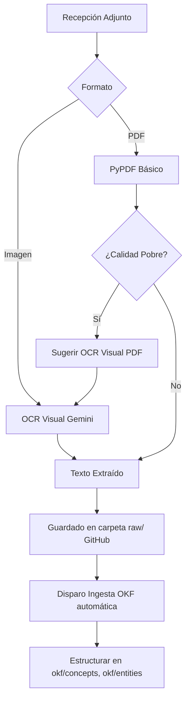

# Ingesta Automática (`okf_ingest.py` y OCR)

Ubicación: `github-bot-plugin/github-bot-plugin/github_bot/okf_ingest.py`

Cuando un estudiante sube materiales (PDFs o fotografías), el sistema activa pipelines de procesamiento para transformarlos en conocimiento útil (Formato OKF - Open Knowledge Format).

## Descripción de Ingesta (OKF)

```python
--8<-- "moodle-matrix-dev/github-bot-plugin/github-bot-plugin/github_bot/okf_ingest.py:file_desc"
```

## Flujo de Procesamiento



El módulo `okf_ingest.py` lee dinámicamente las reglas del repositorio remoto (`AGENTS.md`) para estructurar los contenidos, mientras que los módulos auxiliares (`pdf_ingest.py` e `image_ocr.py`) manejan las dependencias específicas de visión artificial y extracción binaria.
