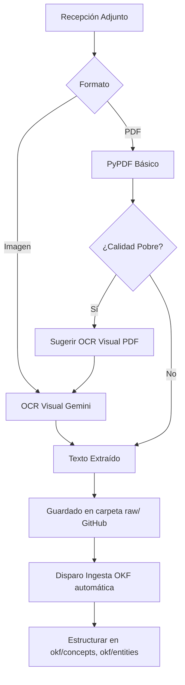

# Ingesta Automática (`okf_ingest.py` y OCR)

Ubicación: `maubot/github-bot-plugin/github_bot/okf_ingest.py`

Cuando un estudiante sube materiales (PDFs o fotografías), el sistema activa pipelines de procesamiento para transformarlos en conocimiento útil (Formato OKF - Open Knowledge Format).

## Descripción de Ingesta (OKF)

```python
"""
Ingesta automática OKF: convierte una fuente recién subida a raw/ en páginas
estructuradas dentro de okf/ (conceptos, entidades, fuentes), siguiendo las
reglas definidas en AGENTS.md del propio repo de la BdC.

Se mantiene aparte de bot.py por lo mismo que estudio.py y pdf_ingest.py: aquí
solo hay "qué pedirle al LLM y cómo interpretar su respuesta", sin nada de
Matrix ni de la API de GitHub, para poder ajustar el prompt sin tocar el resto
del bot.

IMPORTANTE: AGENTS.md se lee en vivo del repo en cada ingesta (con caché TTL,
igual que la documentación de estudio) en vez de copiarse aquí como texto fijo.
Así, si el equipo (Alberto, Jose, Manuel, Incho...) ajusta las convenciones del
wiki en AGENTS.md, la ingesta automática las respeta sin tener que tocar código.
"""

import json
import re
```


## Flujo de Procesamiento



El módulo `okf_ingest.py` lee dinámicamente las reglas del repositorio remoto (`AGENTS.md`) para estructurar los contenidos, mientras que los módulos auxiliares (`pdf_ingest.py` e `image_ocr.py`) manejan las dependencias específicas de visión artificial y extracción binaria.
