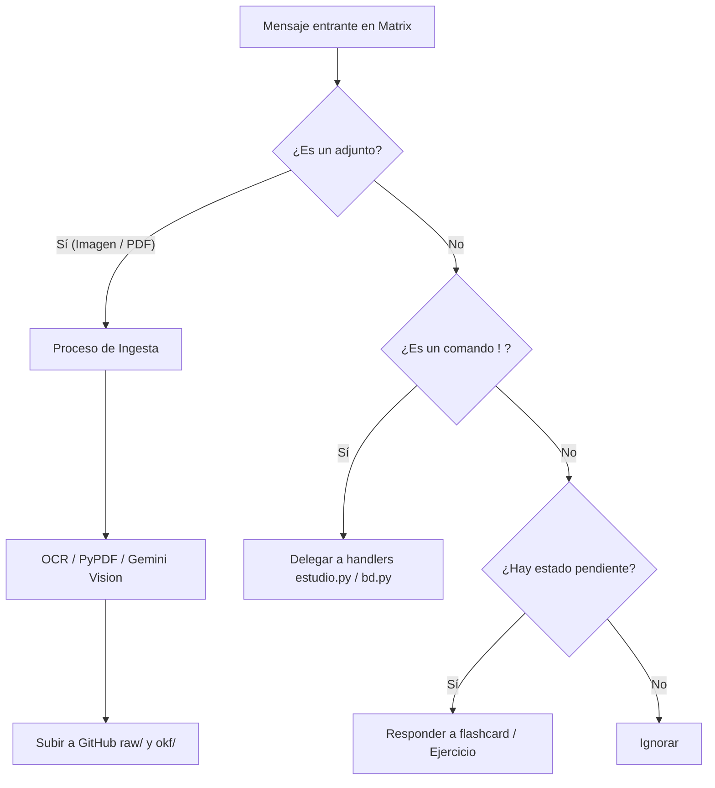

# Core: LlmWikiAssistant (`bot.py`)

Ubicación: `moodle-matrix-dev/maubot/llm-wiki-assistant-plugin/llm_wiki_assistant/bot.py`

El archivo `bot.py` coordina la interacción entre el usuario (vía Matrix), la base de conocimientos (vía GitHub) y el motor de estudio. La clase principal `LlmWikiAssistant` está dividida en múltiples "mixins" para mantener el código modular y fácil de mantener.

## Descripción General

```python
--8<-- "moodle-matrix-dev/maubot/llm-wiki-assistant-plugin/llm_wiki_assistant/bot.py:file_desc"
```

## Diagrama de Interacción de Mensajes



---

## Organización por Mixins

A continuación se documentan todos los métodos expuestos por el bot, organizados por el mixin al que pertenecen. Despliega cada sección para ver el código fuente y la documentación de las funciones correspondientes.

??? note "1. Bot Principal (`bot.py`)"
    Contiene la inicialización de Maubot y la conexión con la base de datos.
    
    **`start`**
    Punto de entrada de Maubot. Inicializa el bot, los semáforos de concurrencia y la conexión a la base de datos.
    ```python
    --8<-- "moodle-matrix-dev/maubot/llm-wiki-assistant-plugin/llm_wiki_assistant/bot.py:start"
    ```
    
    **`get_config_class` y `get_db_upgrade_table`**
    Métodos de clase para enlazar la configuración del plugin y las migraciones de la base de datos.
    ```python
    --8<-- "moodle-matrix-dev/maubot/llm-wiki-assistant-plugin/llm_wiki_assistant/bot.py:get_config_class"
    ```
    ```python
    --8<-- "moodle-matrix-dev/maubot/llm-wiki-assistant-plugin/llm_wiki_assistant/bot.py:get_db_upgrade_table"
    ```

??? note "2. GitMixin (`mixins/git_mixin.py`)"
    Agrupa las operaciones de lectura, escritura y recorrido en repositorios Git.
    
    **`_obtener_git_token`**
    Obtiene el token adecuado según el proveedor (GitLab o GitHub).
    ```python
    --8<-- "moodle-matrix-dev/maubot/llm-wiki-assistant-plugin/llm_wiki_assistant/mixins/git_mixin.py:obtener_git_token"
    ```
    
    **`_obtener_documentacion`**
    Obtiene la documentación o apuntes del repositorio Git.
    ```python
    --8<-- "moodle-matrix-dev/maubot/llm-wiki-assistant-plugin/llm_wiki_assistant/mixins/git_mixin.py:obtener_documentacion"
    ```
    
    **`_recorrer_carpeta` y `_recorrer_carpeta_con_sha`**
    Recorre una carpeta del repositorio, lista sus archivos y obtiene sus hashes SHA.
    ```python
    --8<-- "moodle-matrix-dev/maubot/llm-wiki-assistant-plugin/llm_wiki_assistant/mixins/git_mixin.py:recorrer_carpeta"
    ```
    ```python
    --8<-- "moodle-matrix-dev/maubot/llm-wiki-assistant-plugin/llm_wiki_assistant/mixins/git_mixin.py:recorrer_carpeta_con_sha"
    ```
    
    **`_listar_rutas` y `_listar_carpetas`**
    Lista las rutas y directorios disponibles en el repositorio utilizando la caché en memoria.
    ```python
    --8<-- "moodle-matrix-dev/maubot/llm-wiki-assistant-plugin/llm_wiki_assistant/mixins/git_mixin.py:listar_rutas"
    ```
    ```python
    --8<-- "moodle-matrix-dev/maubot/llm-wiki-assistant-plugin/llm_wiki_assistant/mixins/git_mixin.py:listar_carpetas"
    ```
    
    **`_descargar_contenido_fichero`**
    Descarga de archivos desde el repositorio.
    ```python
    --8<-- "moodle-matrix-dev/maubot/llm-wiki-assistant-plugin/llm_wiki_assistant/mixins/git_mixin.py:descargar_contenido_fichero"
    ```
    
    **`_guardar_ficheros_en_carpeta`**
    Lógica final que empuja los archivos extraídos o subidos hacia el repositorio de Git con sus respectivos metadatos.
    ```python
    --8<-- "moodle-matrix-dev/maubot/llm-wiki-assistant-plugin/llm_wiki_assistant/mixins/git_mixin.py:guardar_ficheros_en_carpeta"
    ```
    
    **`_resolver_ruta_unica`**
    Resuelve y valida ambigüedades cuando un estudiante especifica el nombre de un archivo sin la ruta completa.
    ```python
    --8<-- "moodle-matrix-dev/maubot/llm-wiki-assistant-plugin/llm_wiki_assistant/mixins/git_mixin.py:resolver_ruta_unica"
    ```
    
    **`_obtener_sha_y_contenido_github` y `_obtener_agents_md`**
    Recuperan información crítica de los archivos remotos, en especial las instrucciones del esquema OKF.
    ```python
    --8<-- "moodle-matrix-dev/maubot/llm-wiki-assistant-plugin/llm_wiki_assistant/mixins/git_mixin.py:obtener_sha_y_contenido_github"
    ```
    ```python
    --8<-- "moodle-matrix-dev/maubot/llm-wiki-assistant-plugin/llm_wiki_assistant/mixins/git_mixin.py:obtener_agents_md"
    ```
    
    **Operaciones CRUD de Git**
    Capa de abstracción que delega las operaciones (crear, actualizar, borrar, mover) hacia la librería de cliente Git.
    ```python
    --8<-- "moodle-matrix-dev/maubot/llm-wiki-assistant-plugin/llm_wiki_assistant/mixins/git_mixin.py:subir_o_actualizar_archivo_github"
    ```
    ```python
    --8<-- "moodle-matrix-dev/maubot/llm-wiki-assistant-plugin/llm_wiki_assistant/mixins/git_mixin.py:subir_archivo_github"
    ```
    ```python
    --8<-- "moodle-matrix-dev/maubot/llm-wiki-assistant-plugin/llm_wiki_assistant/mixins/git_mixin.py:borrar_archivo_github"
    ```
    ```python
    --8<-- "moodle-matrix-dev/maubot/llm-wiki-assistant-plugin/llm_wiki_assistant/mixins/git_mixin.py:mover_archivo_github"
    ```
    
    **`_append_log_okf`**
    Guarda un historial en el log OKF cada vez que el LLM genera o modifica conceptos.
    ```python
    --8<-- "moodle-matrix-dev/maubot/llm-wiki-assistant-plugin/llm_wiki_assistant/mixins/git_mixin.py:append_log_okf"
    ```

??? note "3. OcrMixin (`mixins/ocr_mixin.py`)"
    Agrupa todo lo relacionado con la recepción de adjuntos, su procesamiento con OCR (texto e imágenes) y la interacción con el estudiante para decidir su destino.
    
    **`_descargar_adjunto`**
    Descarga de archivos enviados a la sala de Matrix.
    ```python
    --8<-- "moodle-matrix-dev/maubot/llm-wiki-assistant-plugin/llm_wiki_assistant/mixins/ocr_mixin.py:descargar_adjunto"
    ```
    
    **`_procesar_confirmacion_ocr`**
    Procesa la decisión del usuario sobre si aplicar OCR multimodal exhaustivo o extracción de texto simple.
    ```python
    --8<-- "moodle-matrix-dev/maubot/llm-wiki-assistant-plugin/llm_wiki_assistant/mixins/ocr_mixin.py:procesar_confirmacion_ocr"
    ```
    
    **`_encolar_para_lote` y `_debounce_lote`**
    Mecanismo para agrupar múltiples subidas de archivos consecutivos y procesarlos como un único lote tras un retardo configurado (debounce).
    ```python
    --8<-- "moodle-matrix-dev/maubot/llm-wiki-assistant-plugin/llm_wiki_assistant/mixins/ocr_mixin.py:encolar_para_lote"
    ```
    ```python
    --8<-- "moodle-matrix-dev/maubot/llm-wiki-assistant-plugin/llm_wiki_assistant/mixins/ocr_mixin.py:debounce_lote"
    ```
    
    **`_vista_previa_transcripcion`**
    Genera una vista previa truncada del texto extraído de un documento para el usuario.
    ```python
    --8<-- "moodle-matrix-dev/maubot/llm-wiki-assistant-plugin/llm_wiki_assistant/mixins/ocr_mixin.py:vista_previa_transcripcion"
    ```
    
    **Flujo de Destino (`_procesar_respuesta_destino` y `_procesar_renombrado`)**
    Coordinan el diálogo interactivo con el estudiante para decidir la carpeta final en el repositorio y si se debe modificar el nombre del archivo.
    ```python
    --8<-- "moodle-matrix-dev/maubot/llm-wiki-assistant-plugin/llm_wiki_assistant/mixins/ocr_mixin.py:procesar_respuesta_destino"
    ```
    ```python
    --8<-- "moodle-matrix-dev/maubot/llm-wiki-assistant-plugin/llm_wiki_assistant/mixins/ocr_mixin.py:procesar_renombrado"
    ```

??? note "4. IngestMixin (`mixins/ingest_mixin.py`)"
    Agrupa las operaciones de ingesta automatizada de documentos hacia el formato estructurado OKF.
    
    **`_ejecutar_ingest_automatico` y `_ejecutar_ingest_por_lotes`**
    Procesos automáticos o desencadenados por lotes para diseccionar documentos en bruto y convertirlos en piezas atómicas (flashcards, entidades, conceptos).
    ```python
    --8<-- "moodle-matrix-dev/maubot/llm-wiki-assistant-plugin/llm_wiki_assistant/mixins/ingest_mixin.py:ejecutar_ingest_automatico"
    ```
    ```python
    --8<-- "moodle-matrix-dev/maubot/llm-wiki-assistant-plugin/llm_wiki_assistant/mixins/ingest_mixin.py:ejecutar_ingest_por_lotes"
    ```
    
    **`ingest_lotes_handler`**
    Comando para iniciar manualmente la ingesta por lotes (para documentos grandes).
    ```python
    --8<-- "moodle-matrix-dev/maubot/llm-wiki-assistant-plugin/llm_wiki_assistant/mixins/ingest_mixin.py:ingest_lotes_handler"
    ```

??? note "5. ComandosMixin (`mixins/comandos/`)"
    Contiene el manejador principal de mensajes y todos los comandos interactivos (`!flashcard`, `!documento`, `!ayuda`, etc.) con los que interactúa el usuario.
    
    **`on_message`**
    Manejador principal de eventos de mensaje. Procesa todos los mensajes entrantes de la sala, evalúa candados de concurrencia y delega el flujo a los procesos de OCR o comandos.
    ```python
    --8<-- "moodle-matrix-dev/maubot/llm-wiki-assistant-plugin/llm_wiki_assistant/mixins/comandos/mensajes.py:on_message"
    ```
    
    **Curación Explícita**
    Manejadores para visualizar metadatos de documentos, borrarlos con confirmación, moverlos y gestionar carpetas.
    ```python
    --8<-- "moodle-matrix-dev/maubot/llm-wiki-assistant-plugin/llm_wiki_assistant/mixins/comandos/documento.py:documento_handler"
    ```
    ```python
    --8<-- "moodle-matrix-dev/maubot/llm-wiki-assistant-plugin/llm_wiki_assistant/mixins/comandos/borrar.py:borrar_handler"
    ```
    ```python
    --8<-- "moodle-matrix-dev/maubot/llm-wiki-assistant-plugin/llm_wiki_assistant/mixins/comandos/borrar.py:procesar_confirmacion_borrado"
    ```
    ```python
    --8<-- "moodle-matrix-dev/maubot/llm-wiki-assistant-plugin/llm_wiki_assistant/mixins/comandos/mover.py:mover_handler"
    ```
    ```python
    --8<-- "moodle-matrix-dev/maubot/llm-wiki-assistant-plugin/llm_wiki_assistant/mixins/comandos/carpeta.py:carpeta_handler"
    ```
    ```python
    --8<-- "moodle-matrix-dev/maubot/llm-wiki-assistant-plugin/llm_wiki_assistant/mixins/comandos/carpeta.py:carpeta_crear_handler"
    ```
    ```python
    --8<-- "moodle-matrix-dev/maubot/llm-wiki-assistant-plugin/llm_wiki_assistant/mixins/comandos/carpeta.py:carpeta_listar_handler"
    ```
    ```python
    --8<-- "moodle-matrix-dev/maubot/llm-wiki-assistant-plugin/llm_wiki_assistant/mixins/comandos/carpeta.py:carpeta_borrar_handler"
    ```
    ```python
    --8<-- "moodle-matrix-dev/maubot/llm-wiki-assistant-plugin/llm_wiki_assistant/mixins/comandos/carpeta.py:procesar_confirmacion_borrado_carpeta"
    ```
    
    **Consultas y Estadísticas**
    ```python
    --8<-- "moodle-matrix-dev/maubot/llm-wiki-assistant-plugin/llm_wiki_assistant/mixins/comandos/pregunta.py:pregunta_handler"
    ```
    ```python
    --8<-- "moodle-matrix-dev/maubot/llm-wiki-assistant-plugin/llm_wiki_assistant/mixins/comandos/ficheros.py:ficheros_handler"
    ```
    ```python
    --8<-- "moodle-matrix-dev/maubot/llm-wiki-assistant-plugin/llm_wiki_assistant/mixins/comandos/estadisticas.py:estadisticas_handler"
    ```
    ```python
    --8<-- "moodle-matrix-dev/maubot/llm-wiki-assistant-plugin/llm_wiki_assistant/mixins/comandos/trazabilidad.py:trazabilidad_handler"
    ```
    ```python
    --8<-- "moodle-matrix-dev/maubot/llm-wiki-assistant-plugin/llm_wiki_assistant/mixins/comandos/trazabilidad.py:trazabilidad_qa_handler"
    ```
    ```python
    --8<-- "moodle-matrix-dev/maubot/llm-wiki-assistant-plugin/llm_wiki_assistant/mixins/comandos/trazabilidad.py:trazabilidad_interacciones_handler"
    ```
    ```python
    --8<-- "moodle-matrix-dev/maubot/llm-wiki-assistant-plugin/llm_wiki_assistant/mixins/comandos/trazabilidad.py:trazabilidad_curacion_handler"
    ```
    ```python
    --8<-- "moodle-matrix-dev/maubot/llm-wiki-assistant-plugin/llm_wiki_assistant/mixins/comandos/trazabilidad.py:trazabilidad_exportar_handler"
    ```
    
    **Herramientas de Estudio Interactivas**
    Comandos de recuperación activa para afianzar conceptos y forzar explicaciones sintéticas.
    ```python
    --8<-- "moodle-matrix-dev/maubot/llm-wiki-assistant-plugin/llm_wiki_assistant/mixins/comandos/base.py:plantear_pregunta"
    ```
    ```python
    --8<-- "moodle-matrix-dev/maubot/llm-wiki-assistant-plugin/llm_wiki_assistant/mixins/comandos/base.py:plantear_pregunta_concepto"
    ```
    ```python
    --8<-- "moodle-matrix-dev/maubot/llm-wiki-assistant-plugin/llm_wiki_assistant/mixins/comandos/base.py:evaluar_pendiente"
    ```
    ```python
    --8<-- "moodle-matrix-dev/maubot/llm-wiki-assistant-plugin/llm_wiki_assistant/mixins/comandos/flashcard.py:flashcard_handler"
    ```
    ```python
    --8<-- "moodle-matrix-dev/maubot/llm-wiki-assistant-plugin/llm_wiki_assistant/mixins/comandos/ejercicio.py:ejercicio_handler"
    ```
    ```python
    --8<-- "moodle-matrix-dev/maubot/llm-wiki-assistant-plugin/llm_wiki_assistant/mixins/comandos/concepto.py:concepto_handler"
    ```
    ```python
    --8<-- "moodle-matrix-dev/maubot/llm-wiki-assistant-plugin/llm_wiki_assistant/mixins/comandos/feynman.py:feynman_handler"
    ```
    ```python
    --8<-- "moodle-matrix-dev/maubot/llm-wiki-assistant-plugin/llm_wiki_assistant/mixins/comandos/repasartema.py:repasartema_handler"
    ```
    ```python
    --8<-- "moodle-matrix-dev/maubot/llm-wiki-assistant-plugin/llm_wiki_assistant/mixins/comandos/base.py:avanzar_repaso_tema"
    ```
    ```python
    --8<-- "moodle-matrix-dev/maubot/llm-wiki-assistant-plugin/llm_wiki_assistant/mixins/comandos/ejerciciostema.py:ejerciciostema_handler"
    ```
    ```python
    --8<-- "moodle-matrix-dev/maubot/llm-wiki-assistant-plugin/llm_wiki_assistant/mixins/comandos/resumen.py:resumen_handler"
    ```
    ```python
    --8<-- "moodle-matrix-dev/maubot/llm-wiki-assistant-plugin/llm_wiki_assistant/mixins/comandos/mapa.py:mapa_handler"
    ```
    
    **Menú de Ayuda**
    ```python
    --8<-- "moodle-matrix-dev/maubot/llm-wiki-assistant-plugin/llm_wiki_assistant/mixins/comandos/ayuda.py:ayuda_handler"
    ```

??? note "6. CacheMixin (`mixins/cache_mixin.py`)"
    Manejo y limpieza de cachés para el plugin.
    
    **`_invalidar_cache`**
    Limpia la caché tras operaciones de escritura en el repositorio.
    ```python
    --8<-- "moodle-matrix-dev/maubot/llm-wiki-assistant-plugin/llm_wiki_assistant/mixins/cache_mixin.py:invalidar_cache"
    ```

??? note "7. LocksMixin (`mixins/locks_mixin.py`)"
    Control de concurrencia y cerrojos (locks) por usuario para evitar condiciones de carrera al responder comandos que toman tiempo.
    
    **`_get_user_lock`**
    Manejo de cerrojos de concurrencia por usuario.
    ```python
    --8<-- "moodle-matrix-dev/maubot/llm-wiki-assistant-plugin/llm_wiki_assistant/mixins/locks_mixin.py:get_user_lock"
    ```

??? note "8. UtilsMixin (`mixins/utils_mixin.py`)"
    Utilidades generales como la inicialización de los modelos LLM y renderizado de texto.
    
    **`_crear_llm` y `_crear_llm_vision`**
    Crea e inicializa las instancias del modelo de lenguaje de Google Gemini (texto y visión).
    ```python
    --8<-- "moodle-matrix-dev/maubot/llm-wiki-assistant-plugin/llm_wiki_assistant/mixins/utils_mixin.py:crear_llm"
    ```
    ```python
    --8<-- "moodle-matrix-dev/maubot/llm-wiki-assistant-plugin/llm_wiki_assistant/mixins/utils_mixin.py:crear_llm_vision"
    ```
    
    **`_responder_con_latex`**
    Envía una respuesta por Matrix procesando previamente cualquier fórmula LaTeX para renderizarla como imagen PNG en un mensaje HTML.
    ```python
    --8<-- "moodle-matrix-dev/maubot/llm-wiki-assistant-plugin/llm_wiki_assistant/mixins/utils_mixin.py:responder_con_latex"
    ```